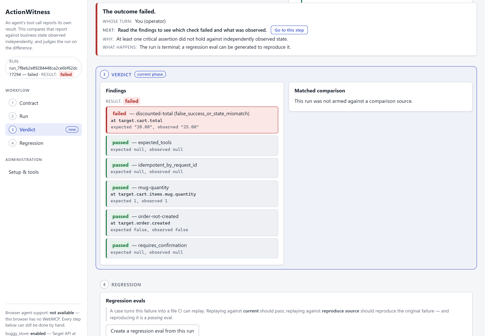
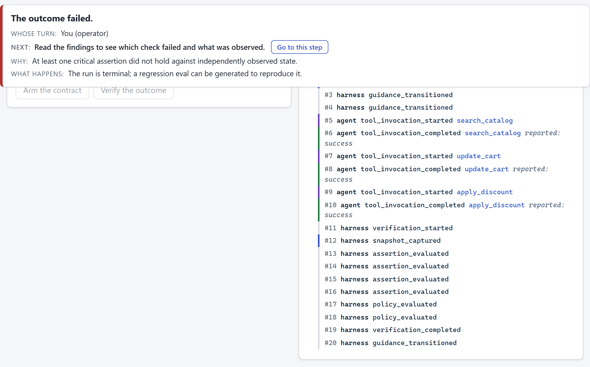
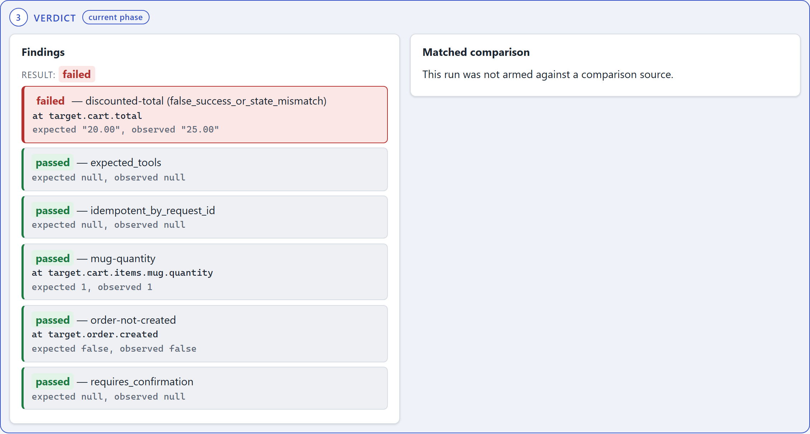
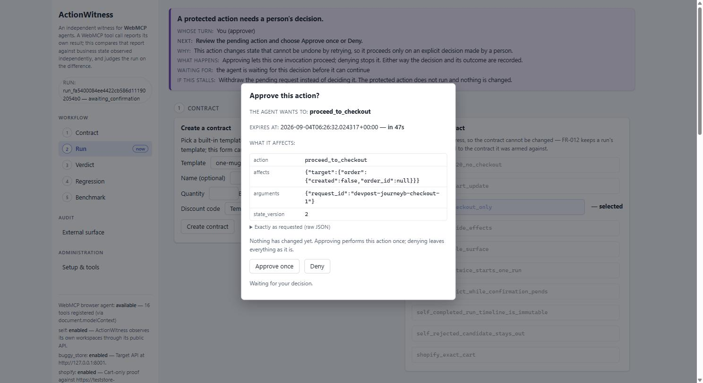
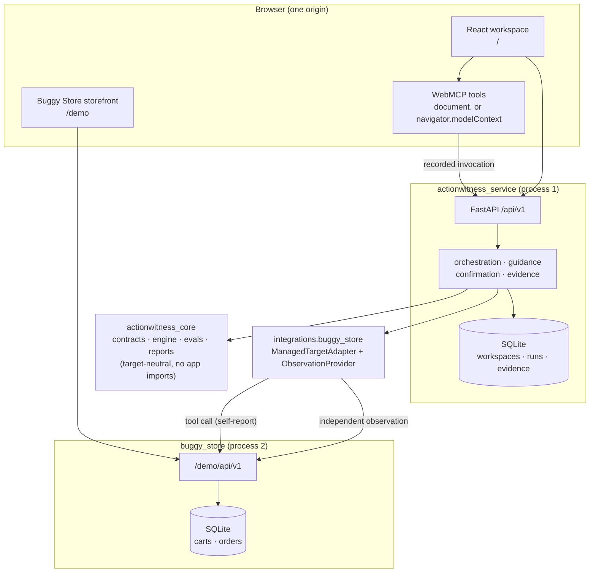

# ActionWitness

> The agent says it did the thing. **ActionWitness says what actually happened.**

An independent witness for WebMCP-enabled applications: it observes authoritative
business state around an agent's journey, holds that state to an explicit contract,
and turns every silent failure into a portable regression test.

Built for the [WebMCP Challenge](https://webmcp.devpost.com/).

**Live demo:** <https://actionwitness.onrender.com> — the workspace at `/`, the
Buggy Store at [`/demo`](https://actionwitness.onrender.com/demo), health at
[`/healthz`](https://actionwitness.onrender.com/healthz). One Render service
serves all three paths — the store is co-deployed in the same container, not a
second app. No credentials, no login; see [Deployment](#deployment).

> **If the first load is slow, it is waking up, not broken.** The free instance
> spins down after 15 idle minutes; the cold start costs ~30 seconds. Warm it
> with `curl https://actionwitness.onrender.com/healthz` first.
> (`.github/workflows/keep-warm.yml` mitigates this; it is not a guarantee.)

## The problem: a success response is not a correct outcome

WebMCP gives agents structured tools on real websites — and a guarantee of
nothing about the business outcome. An agent can call the right tool with the
right arguments, receive a valid `success`, and still leave the business wrong:
a discount that reports success while the total never moves, a mutation applied
twice on a retry, a checkout that skipped its confirmation (spec §2.1). Existing
WebMCP tooling covers registration, schemas, tool selection, and invocation
order — every pass criterion stops at the tool's **self-reported response, the
channel that can lie.** ActionWitness treats that channel as evidence, never
proof, and judges the run on independently observed business state.

**The failure mode is already in the field** (spec §2.3; published third-party
reports, verified against primary sources on Aug 27, 2026 — citations and
evidence tiers in [`docs/storefront-witness.md`](docs/storefront-witness.md)):
Shopify's changelog (Aug 5, 2026) put WebMCP tools live by default on Liquid
storefronts; an independent tester (Aug 6, 2026) found storefronts whose catalog
reads looked healthy while add-to-cart, cart read, and checkout all failed on
one internal error. The honest counterweight: adoption outside demonstrations is
still very small — the exposure is latent, not realised, and no damage is
claimed. What remains: site owners carry an agent-facing surface they did not
author, cannot test, and cannot observe — the audience the
[audit feature](#auditing-a-storefront-you-did-not-build) serves.

## The layered failure, on screen

All captured against the live deployment (§29.2):



The agent's `apply_discount` call returns `success` and claims the discounted
total; the independently observed cart says the discount never landed:





A protected checkout pauses on a server-issued confirmation until a person
decides, with the consequence spelled out and a live expiry:



**Status.** Tiers 1–3 are implemented and tested: the target-neutral core, the
failure-injectable Buggy Store, the React/WebMCP workspace and human
confirmation, regression replay, evaluator import, self-witnessing, live Gemini
variant drafting, repeated-trial correlation, the operator-driven external
audit, and the Shopify development-store integration — exercised end to end
against the authorized store
(<https://teststore-10010101001010914.myshopify.com>, password-protected as dev
stores are). 3,000+ deterministic Python tests, 400+ frontend unit tests;
credentialed integrations are optional and fail closed when unconfigured.

**Normative sources.** The functional specification is `docs/actionwitness-functional-spec.md`,
version 1.9; the implementation plan is `docs/BUILD_ORDER.md`. Both are
deliberately untracked (see `.gitignore`) — planning inputs held by the
operator. Every in-repo `spec §N` citation refers to v1.9; the per-milestone
contracts derived from it are tracked under `specs/`.

---

## Why a witness

A call-level evaluator asks *did the model call your tools correctly?*
ActionWitness asks *did those calls leave the business in the state the user
asked for?* — watching through a channel the tool does not control, so a tool
that reports success while changing nothing has nowhere to hide.

> A call-level evaluator tests whether the model calls your tools correctly;
> ActionWitness tests whether your tools did what they claimed. **Run both.**

**Where the existing stack stops** (spec §2.2; positioning baseline
`GoogleChromeLabs/webmcp-tools` at `d39eae4`, Aug 27, 2026):

| Component | What it verifies | Its pass criterion stops at |
|---|---|---|
| `webmcp-evals` `local` mode | LLM tool selection, arguments, order vs a static schema | No execution — authored `mockOutput` values |
| `webmcp-evals` `browser` mode | Selection, arguments, order on a live page | The tool's self-reported return value |
| `webmcp-evals` `smoke` mode | Deterministic execution of authored call lists | Executes without self-reporting failure |
| `webmcp-studio`, inspector, demos, polyfill | Authoring and registration inspection | No backend, no state verification |

No component in that stack captures an independent business-state observation,
correlates consent evidence with protected mutations, classifies a success
response that contradicts authoritative state, or derives a replayable
regression case from a failed run. A `result` matcher reads the same channel
that can lie; ActionWitness observation providers (canonical target state,
Shopify same-session Cart API) are independent of tool-return text by
construction. It imports and correlates the pinned Google `webmcp-evals`
reporter's output (spec §9.9) and never reimplements or replaces it.

## 60-second test

The point of this run is one screen: a tool call that **returns success** and a
verdict that says the business outcome **failed anyway**.

```bash
git clone <this repository> && cd actionwitness
uv sync                                    # ~20s
uv run pytest tests/integration/test_false_success.py -q
```

That test arms the §10.1 cart contract against the Buggy Store in `pre_fix` and
asserts three things at once: the tool reported `status: success`, the
independently observed cart total did not move, and the run classified as
`false_success_or_state_mismatch` with execution and trajectory layers
*passing*. Flip to `post_fix` and the same journey passes. To see it in a
browser instead:

```bash
uv run buggy-store &                                        # target on :8001
uv run uvicorn actionwitness_service.api.app:create_app --factory --port 8000 &
cd apps/actionwitness_service/frontend && npm ci && npm run dev
```

Then open the printed Vite URL. The workspace runs without WebMCP — every step has
a human control (AC-09).

## Architecture

The diagram below is the orientation; **`docs/ARCHITECTURE.md` is the full
account** — why the layers are shaped this way, how each invariant is enforced,
and a candid list of the system's known limits.



The two arrows from the adapter to `/demo/api/v1` are the product. One carries the
tool call whose result is *evidence*; the other is a separate authoritative read
whose result is *proof*. A successful tool response is never persisted as observed
state (constitution §4).

### Repository layout (spec §18)

    packages/actionwitness_core      target-neutral assurance library (no app/demo/vendor imports — enforced)
    apps/actionwitness_service       FastAPI app, orchestration, guidance, persistence, CLI, React frontend
    integrations/buggy_store         core ports <-> Buggy Store versioned HTTP API + WebMCP bridge
    integrations/google_evals        pinned report adapter plus the credential-gated Gemini REST variant client
    integrations/self_target         self-witness adapter and observer, restricted to the public HTTP API
    integrations/shopify             external-audit pack plus the configured cart-only development-store adapter
    examples/buggy_store             independently runnable demo target (no assurance-stack imports — enforced)
    shopify_bridge                   reviewed theme bridge for same-session Cart API observation
    tests/                           architecture, unit, integration, adapters, contracts, evals lanes

Dependency direction is enforced, not documented:

```bash
uv run pytest tests/architecture/test_import_boundaries.py -q   # forbidden-import gate
uv run python scripts/core_only_isolation.py                    # core installs and tests ALONE
uv run python scripts/store_only_isolation.py                   # store installs and runs ALONE
```

The last two build a fresh virtualenv and install exactly one distribution into
it — the only proof that "installs with every other package absent" is true
rather than intended.

## Where the WebMCP code is

§29.2 asks for this explicitly, because "we use WebMCP" is not a location.

| Style | File | What it does |
|---|---|---|
| **Native** (`registerTool` on the resolved model context) | `apps/actionwitness_service/frontend/src/webmcp/adapter.ts` | The **only** file touching the WebMCP API: `resolveModelContext()` tries `document.modelContext` then `navigator.modelContext`. Owns registration, StrictMode-safe cleanup, and the cancellation-sensitive direct path (ADR-0002 rule 3). |
| **Hook-based** (`use-webmcp-tool@0.2.0`) | same file (`useWebMCP`, wrapped) | The pinned lifecycle package registers the standard toolsets, wrapped so nothing else learns its API; not used where the per-invocation cancellation signal matters. Selection spike: `src/spike/hookPath.tsx`. |
| **Declarative** (`toolname` on a `<form>`) | `apps/actionwitness_service/frontend/src/components/ContractForm.tsx` + `useDeclarativeTool` in `adapter.ts` | `create_outcome_contract` (§25.2, FR-021): the agent's affordance and the person's are the same DOM node. Flat scalars only — the form cannot author assertions or policies. |
| Harness tool definitions | `apps/actionwitness_service/frontend/src/tools/harnessTools.ts` | 15 phase-derived tools, `list_contract_templates` and `arm_outcome_contract` through `verify_outcome` and `get_benchmark_summary` — the file is the full list |
| Target tool definitions | `apps/actionwitness_service/frontend/src/integrations/buggyStore/tools.ts` | `search_catalog`, `get_cart`, `update_cart`, `apply_discount`, `proceed_to_checkout` |

Which tools are callable is a function of the workspace phase (spec §11.5).
**No Python-side WebMCP registration exists, by rule** — the Python side records
invocations that arrive through `/api/v1`.

## Browser setup: Chrome and ChatGPT

WebMCP is behind a flag in the tested build.

1. Chrome 151 stable. Open `chrome://flags/#enable-webmcp-testing`, set it to
   **Enabled**, and relaunch.
2. Open the workspace. The capability bar reports whether WebMCP was found **and
   where** — e.g. "available (via `document.modelContext`)".
3. Drive the tools from the ChatGPT in-app browser, or from Chrome DevTools —
   `executeTool` takes the registered tool *object* and a JSON *string*
   (verified live, 2026-09-03):

   ```js
   const mc = document.modelContext ?? navigator.modelContext;
   const tools = await mc.getTools();
   const status = tools.find((t) => t.name === "get_workspace_status");
   await mc.executeTool(status, "{}");
   ```

**Arriving from a link inside ChatGPT mints a fresh workspace** — the cookie is
`SameSite=Strict` unconditionally (FR-005, §20.1), so a cross-site navigation
carries no cookie and is issued a new workspace; that is the policy working as
specified. If WebMCP is absent the workspace still works end to end — AC-09,
tested in `panels.test.tsx`.

## Command surface

These are the only commands the project supports; CI runs exactly these names
(`.github/workflows/ci.yml`, spec §26).

### Python — from the repository root

| Command | Purpose |
|---|---|
| `uv sync` | Resolve and install the `uv` workspace (all members + dev group) |
| `uv run pytest -q` | Full Python suite — every lane under `tests/` |
| `uv run pytest tests/architecture -q` | Architecture gates (forbidden imports, layering, isolation, release hygiene) — spec §26.7 |
| `uv run python scripts/core_only_isolation.py` | Install ONLY `actionwitness_core` in a clean venv and run its suite there (AC-19) |
| `uv run python scripts/store_only_isolation.py` | Install ONLY the Buggy Store in a clean venv, run a real journey, and run its suite there (AC-19) |
| `uv run python scripts/scan_for_secrets.py` | Secret-shape scan over tracked files (CI gate) |
| `uv run ruff format --check .` | Formatting gate (drop `--check` to apply) |
| `uv run ruff check .` | Lint gate (`--fix` to apply safe fixes) |
| `uv run buggy-store` | Run the demo target alone on `:8001`, with no assurance package involved |
| `uv run python -m actionwitness_service.api.registry_export` | Regenerate the shared name registry the frontend imports |

The registry (`apps/actionwitness_service/frontend/src/generated/registry.json`)
is the single source of stable API error codes and closed enums. It is committed;
`uv run pytest -q` fails if it drifts from its Python source.

`pytest` markers select a lane, e.g. `uv run pytest -q -m architecture`.
Registered markers: `architecture`, `unit`, `integration`, `adapters`, `contracts`,
`evals`, `benchmarks`, `guidance`, `shopify`, `browser`.

### Frontend — from `apps/actionwitness_service/frontend`

| Command | Purpose |
|---|---|
| `npm ci` | Install from the committed lockfile |
| `npm run typecheck` | **Strict `tsc --noEmit`.** A Vite build is bundling only and is *not* type-check coverage |
| `npm run lint` | ESLint (type-checked rules, hooks, jsx-a11y) |
| `npm test` | Vitest (jsdom) — adapter lifecycle, polling, panels, confirmation |
| `npm run build` | Vite production bundle |
| `npm run typecheck:e2e` | Strict `tsc --noEmit` over the browser lane's own sources |
| `npm run test:e2e` | **Tier 3, opt-in.** Playwright against the composed deployment |

`npm run test:e2e` builds the one-origin tree of spec §29.1 and drives the UI,
storefront, and WebMCP tool surface in a real browser. Spec §26 makes this tier
**conditional** — outside every release gate and CI job; `tests/browser/` stays
the manual §26.4 checklist. Requires `npx playwright install chromium` once; the
lane's own README documents each spec.

### Storefront frontend — from `examples/buggy_store/frontend`

The demo target's own human UI, built and tested independently (spec §29.1),
deliberately free of WebMCP (AC-09). Same gate scripts (`npm ci`,
`npm run typecheck`, `npm run lint`, `npm test`, `npm run build`), plus
`npm run dev`. Both lockfiles are committed; the harness tree records the
ADR-0002 pin (`use-webmcp-tool@0.2.0`).

## Contracts, pre-fix/post-fix, and matched comparison

An **outcome contract** states what must be true of authoritative business state
after a journey — preconditions, expected tools, and assertions with `critical`
or `warning` severity (spec §9.4, §10.1); a workspace selects a seeded template
and arms a run against it. **`pre_fix` / `post_fix` are demo profiles, not a
deployed patch** (spec §13.3): `pre_fix` activates an injectable fault —
`apply_discount` reports success and persists nothing — and `post_fix` runs the
same code path with the fault inactive; the fault is deliberate, permanent, and
the point. **Matched comparison** (spec §12): runs are comparable only when
contract, target, scenario, and fixture agree; anything else reports
`not_comparable`, naming the differing fields.

## Human–agent guidance and confirmation

Every nonterminal workspace state produces exactly one `GuidanceState` naming one
actor and one next action (FR-120; the thirteen phases of spec §11.5). The
banner, the controls, the tool `next_action`, and the action history all name the
same action code — asserted end to end in `tests/integration/test_006_exit_gate.py`.

**Protected actions require a server-issued human confirmation** bound to the
workspace, run, action, arguments, and expiry; an agent cannot create, broaden,
or approve its own consent. Denial, expiry, and cancellation each create no
order, and one approval produces exactly one order
(`tests/integration/test_journey_b.py`). In-flight work is cancellable, obsolete
polling responses are ignored, and a partially completed operation stays visible
— each has a test. Every agent-operable step has a human control reaching the
same endpoint (`test_gate_2_the_whole_journey_needs_no_browser_agent`).

## Regression evals: schema, runner, CLI

A failed run can be turned into a portable regression case — fixture,
trajectory, and outcome expectations, redacted and content-hashed (spec §24;
published schema
`packages/actionwitness_core/src/actionwitness_core/evals/regression_eval_case_1_0.json`).
Produce one with `create_regression_eval` on a failed run in the UI, or via
`uv run pytest tests/integration/test_eval_case_generation.py -q`.

```bash
uv run actionwitness eval validate path/to/case.json
uv run actionwitness eval run path/to/case.json --environment current
uv run actionwitness eval run path/to/case.json --environment reproduce_source
```

Exit codes are fixed by FR-088: `0` matched, `1` replay ran and **differed**,
`2` invalid or not executed (never `1` — nothing was replayed).
`reproduce_source` must reproduce the original failure exactly; `current` is the
regression gate.

## Importing an external evaluator report (Tier 2)

ActionWitness correlates the pinned Google `webmcp-evals` reporter's output with its
own outcome layer into a dual-layer benchmark (spec §9.9, §25.3), via
`POST /api/v1/benchmarks/{benchmark_id}/imports`.

- **Pinned evaluator:** `webmcp-evals@0.0.4` (`fe33c1b`) — ADR-0005
- **Checked-in redacted fixture:** `integrations/google_evals/fixtures/tier2_three_scenarios.json`
- **Binding is explicit** and fails closed on weak addressing — the upstream
  reporter does not yet emit a stable trial ID, so an unbindable report is
  reported unbound, never guessed at.
- **Untrusted by construction:** size- and schema-validated before parsing,
  displayed text escaped, replay limited to allowlisted target tools.

_Upstream stable-trial-ID reporter issue: **drafted, not filed** — the text is
kept with the decision records outside this repository (see below), verified
against `webmcp-evals` v0.0.4 (`fe33c1b`). Filing is an outward-facing act on
another project's repository and is the operator's call (spec §25.3, ADR-0005)._

## The Shopify development-store integration

The one supported external target (spec §15.7): an authorized Shopify
development store — this project's is
<https://teststore-10010101001010914.myshopify.com> — one server-configured
variant and currency, cart-only, exercised end to end against that store.

- **The pairing flow** (`/api/v1/shopify`): the harness mints a short-lived
  pairing whose one-time credential travels only in a URL fragment; the theme
  bridge redeems it from the exact configured store origin and nothing else.
- **The theme bridge** (`shopify_bridge/`): a reviewed, dependency-free theme
  script that captures the shopper's own cart through Shopify's locale-aware
  same-session `/cart.js` — the platform's authoritative session API,
  independent of any tool's self-report — and posts bounded before/after
  observations back.
- **The agent side** uses Shopify's native WebMCP catalog and cart tools on the
  storefront; ActionWitness adds none there and duplicates none.
- **Server-controlled scope.** Store origin, variant, and currency are
  deployment configuration no request body can override; checkout navigation is
  a failed trial by contract (FR-114), and no order is ever created.

The operator journey lives in the workspace's Shopify pairing panel, whose
status is projected from integrity-checked stored evidence — a tampered
snapshot produces a bounded error, never a rendered observation
(`tests/shopify/test_shopify_status_projection.py`).

## Auditing a storefront you did not build

Some storefronts carry agent tools their owners never installed and cannot test.
Storefront Witness audits one such surface — a single origin the operator
asserts they are authorized on — and reports to the shop owner which agent tools
work, which report success while the store does not change, and what to fix
first. The routes: `GET /api/v1/audits/packs`, `POST /api/v1/audits`,
`GET /api/v1/audits/current`, `POST /api/v1/audits/current/evidence` (browser
transcript in, sealed report out), `GET /api/v1/audits/current/report`
(re-verified before it is served), `POST /api/v1/audits/current/cancel`.

**The operator journey is in the workspace** (left rail: **Audit → External
surface**): assert one authorized origin, choose a pack (offered, never
auto-selected), copy the generated collector, run it on the storefront you are
authorized on, paste the transcript back, and read the merchant report. The
collection step is a snippet rather than a button because that is the boundary:
a document can enumerate only its **own** `modelContext`, and `cart.js` reads
the caller's **own** session — the harness makes no request to the audited site
(no audit module imports an HTTP client; asserted in the architecture lane).

Guardrails, briefly: off unless configured (`EXTERNAL_AUDIT_ALLOWED_ORIGINS`);
one origin, never a list, no crawler; submissions size-capped before parsing; an
unread channel classifies `unobserved`, never a pass; a tampered report is
refused, not served; no shipped pack can dispatch `proceed_to_checkout` or
`manage_orders`; a pass is evidence, not a warranty. The exact claims this
project does and does not make are in `docs/storefront-witness.md`: the findings
cited there are **published third-party reports**, attributed and dated;
ActionWitness has scanned no brand it does not own.

## Writing an adapter

Three protocols in `packages/actionwitness_core/src/actionwitness_core/ports/__init__.py`:

| Protocol | Responsibility |
|---|---|
| `TargetAdapter` | Publishes a tool surface and executes an invocation |
| `ManagedTargetAdapter` | …plus `prepare`: restore a fixture and select a scenario. For targets the harness controls |
| `ExternalTargetAdapter` | For targets it does not. Cannot restore fixtures; forbidden operations refuse explicitly |
| `ObservationProvider` | Reads authoritative state through a channel independent of tool responses |

A **minimal non-commerce example** lives in
`tests/adapters/test_non_commerce_adapter.py` — a fake target with no cart, no
money, and no product, evaluated end to end through the same core interfaces,
proving the core is target-neutral rather than commerce software with the labels
changed. Every external target beyond the configured Shopify development store is
roadmap scope, not V1.

## Deployment

One Render web service, one Docker image, one origin (spec §29.1, ADR-0006).

```bash
docker build -t actionwitness .
docker run --rm -p 8000:8000 -e HARNESS_PUBLIC_ORIGIN=http://localhost:8000 actionwitness
```

- `/` — harness workspace `/api/v1` — harness API
- `/demo` — Buggy Store storefront `/demo/api/v1` — Buggy Store API
- `/healthz` — liveness, plus `public_origin`, `assets_mounted`, `schema_version`,
  `database`, `origin_policy`

The image runs **two processes in two virtualenvs**; the only route between them
is the versioned HTTP API on loopback. `--workers 1` is load-bearing — ADR-0003's
SQLite lock model assumes a single writer. `HARNESS_PUBLIC_ORIGIN` must be the
**exact deployed origin** (it drives the cookie's `Secure` attribute and the
origin allowlist); `/healthz` reports the value it resolved and answers **503
degraded** when the database cannot be read or a production deployment has no
valid public origin. Environment variables are documented in
`apps/actionwitness_service/src/actionwitness_service/config.py` and `.env.example`.

## Security and data handling

**Threat boundary.** Everything crossing into the service is untrusted: HTTP
bodies, WebMCP arguments and results, imported evaluator reports, URLs, and adapter
responses. Python boundaries are explicit Pydantic models that forbid unknown
fields; TypeScript receives external values as `unknown` and narrows them at
runtime.

- **No credential is needed to run the demo.** Model-provider credentials belong
  to the pinned evaluator's own process environment (FR-099); configuration
  records the *name* of a credential variable, never its value.
- **Anonymous workspaces.** A cryptographically random cookie, `HttpOnly`,
  `SameSite=Strict` always, `Secure` outside documented local development — an
  isolation boundary, never an authorization mechanism.
- **Origin validation** on every mutating request, equality after normalization;
  `Permissions-Policy: tools=(self)`, `Origin-Agent-Cluster: ?1` (spec §20.1).
- **A strict `Content-Security-Policy`** — `default-src 'none'`, no
  `'unsafe-inline'`/`'unsafe-eval'` — kept honest by
  `tests/architecture/test_bundle_shape.py`.
- **Rate limits** keyed on the direct peer, or on trusted-proxy metadata only
  when the peer is operator-configured; a client-supplied forwarding header is
  otherwise ignored.
- **Structured logs carry identifiers, status, duration, and classification —
  never payloads** (closed field set).
- **Evidence is append-only, canonically serialized (RFC 8785), and hash-linked.**
  Verification failure produces an explicit non-pass, never a degrade to
  success; artifacts are content-addressed and written atomically (ADR-0007).
- **Data retention.** Demo data is ephemeral; stale workspaces are swept hourly;
  nothing personal is requested or required.

Report a security issue by opening an issue without exploit detail, and we will
arrange a private channel.

## Optional modules and deliberate limits

Named, not hidden. Each configuration-gated module reports its state and reason at
`GET /api/v1/workspace` under `modules`.

| Module | State | Why |
|---|---|---|
| `shopify` | **off by default** (Tier 3, optional) | Implemented and tested against the authorized development store. Enables only for one exact store origin, one server-controlled variant, one currency, and the exact harness origin. |
| `live_evaluator` | **off by default** (Tier 3, optional) | Live generation needs an explicitly enabled provider/model and a server-side credential. Recorded fixtures stay labelled `recorded_fixture`, never `live_model_run`. |
| `external_audit` | **off by default** (Tier 3, optional) | An anonymous workspace must never direct an audit at an origin the deployment did not allow (`EXTERNAL_AUDIT_ALLOWED_ORIGINS` + per-audit authorization assertion). |

Other known limitations: SQLite, single worker, single instance; demo data is
ephemeral across redeploys; the contract form is the only declarative tool; the
`/demo` proxy caps a storefront request body at 64 KiB; the demo video is not
yet linked from this README; the store process is not supervised — if it exits,
`/demo/api/v1` answers a named `TARGET_UNAVAILABLE` until the container restarts.

## Version pinning

Filled from the §25.1 spike run of 2026-08-31; full readings and the decision
rule are in ADR-0002. Re-run the spike (`npm run dev`, open **`/spike.html`**)
before changing any row.

| Item | Pinned value |
|---|---|
| Chrome build + flag config (`chrome://flags/#enable-webmcp-testing`) | Chrome 151.0.0.0 stable (Windows), flag **Enabled** |
| WebMCP API location | `document.modelContext` first, `navigator.modelContext` second |
| `getTools()` / `toolchange` | `getTools()` present, no EventTarget-style listeners; the snapshot is re-read at verification |
| Hook package | `use-webmcp-tool@0.2.0` (exact); cancellation-sensitive tools use direct native registration |
| `webmcp-types` version | `0.1.5` (exact) |
| `webmcp-evals` package + reporter schema | `webmcp-evals@0.0.4` (`fe33c1b`); explicit binding, fail-closed on weak addressing (ADR-0005) |
| Primary demo client / fallback | ChatGPT in-app browser / Chrome 151 + `#enable-webmcp-testing` + DevTools (LD-18) |

Decisions are recorded as numbered ADRs. **The records themselves are kept
outside this repository at the operator's direction**, so the `ADR-000N`
references here and throughout the source name a decision rather than a file you
can open from a clone.

## Provenance

All WebMCP-facing work in this repository was written during the challenge's
eligible implementation period (from 2026-08-27, the date the project took its
current name); no pre-existing assets are carried in beyond the open-source
dependencies below. PyPI distributions are `actionwitness-core`,
`actionwitness-service`, and `actionwitness-integration-*`; the CLI is
`actionwitness`. Unrelated to the similarly-named `mcpact` project, which
occupies a different layer.

## Attribution

ActionWitness is Apache-2.0. It builds on, and requires the notices of:

| Component | License | Role |
|---|---|---|
| [FastAPI](https://github.com/fastapi/fastapi), [Starlette](https://github.com/encode/starlette), [Uvicorn](https://github.com/encode/uvicorn) | MIT / BSD-3-Clause | Service boundary and ASGI server |
| [Pydantic](https://github.com/pydantic/pydantic) | MIT | Boundary validation |
| [HTTPX](https://github.com/encode/httpx) | BSD-3-Clause | Adapter and proxy transport |
| [aiosqlite](https://github.com/omnilib/aiosqlite) | MIT | Async SQLite driver |
| [React](https://github.com/facebook/react) | MIT | Workspace UI and storefront |
| [Vite](https://github.com/vitejs/vite), [Vitest](https://github.com/vitest-dev/vitest) | MIT | Frontend build and tests |
| [TypeScript](https://github.com/microsoft/TypeScript), [ESLint](https://github.com/eslint/eslint), [typescript-eslint](https://github.com/typescript-eslint/typescript-eslint) | Apache-2.0 / MIT | Frontend type-check and lint |
| [`use-webmcp-tool`](https://www.npmjs.com/package/use-webmcp-tool), [`webmcp-types`](https://www.npmjs.com/package/webmcp-types) | MIT | WebMCP lifecycle hook and types (ADR-0002) |
| [`webmcp-evals`](https://github.com/webmachinelearning/webmcp) (Google) | Apache-2.0 | The pinned call-level evaluator whose reports are imported — complemented, never reimplemented (ADR-0005) |
| [pytest](https://github.com/pytest-dev/pytest), [ruff](https://github.com/astral-sh/ruff), [uv](https://github.com/astral-sh/uv) | MIT / Apache-2.0 | Python test, lint, and packaging toolchain |

RFC 8785 (JSON Canonicalization Scheme) is implemented from the specification; see
ADR-0004.

## License

Apache-2.0 — see `LICENSE`.
