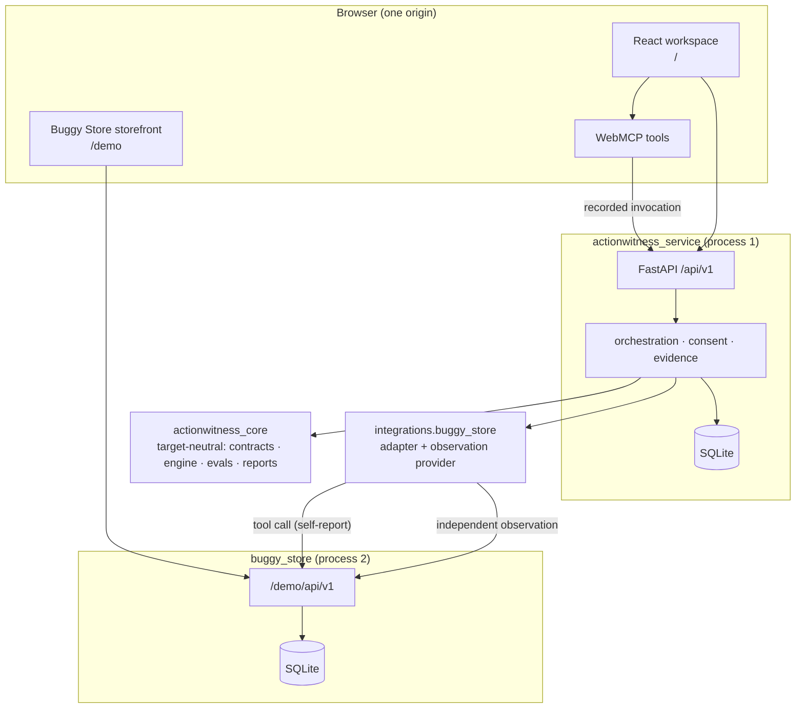

<p align="center">
  
</p>

# ActionWitness

> The agent says it did the thing. **ActionWitness says what actually happened.**

<p align="center">
  <a href="https://github.com/ichiorca/actionwitness/actions/workflows/ci.yml"></a>
  
  
  <a href="LICENSE"></a>
</p>

An independent witness for WebMCP-enabled applications: it observes authoritative
business state around an agent's journey, holds that state to an explicit contract,
and turns every silent failure into a portable regression test.

**[Try it live](https://actionwitness.onrender.com)** ·
**[Watch the 3-minute demo](https://youtu.be/rwDyrnVunXc)** ·
**[Inspect the evidence](docs/SUBMISSION_EVIDENCE.md)** ·
**[Explore the architecture](docs/ARCHITECTURE.md)**

Built for the [WebMCP Challenge](https://webmcp.devpost.com/). One Render service
serves the workspace at `/`, the [Buggy Store](https://actionwitness.onrender.com/demo)
at `/demo`, and [`/healthz`](https://actionwitness.onrender.com/healthz) — the store
is co-deployed in the same container, not a second app. No credentials, no login;
see [Deployment](#deployment).

> **A slow first load is a cold start, not a break.** The free instance spins down
> after 15 idle minutes and takes ~30s to wake; `curl .../healthz` warms it.

## The problem: a success response is not a correct outcome

WebMCP gives agents structured tools on real websites — and guarantees nothing
about the business outcome. An agent can call the right tool with the right
arguments, receive a valid `success`, and still leave the business wrong: a
discount that reports success while the total never moves, a mutation applied twice
on a retry, a checkout that skipped its confirmation (spec §2.1). Existing WebMCP
tooling covers registration, schemas, tool selection and invocation order — every
pass criterion stopping at the tool's **self-reported response, the channel that
can lie.** ActionWitness treats that channel as evidence, never proof, and judges
the run on independently observed business state.

**The failure mode is already in the field** (spec §2.3): Shopify put WebMCP tools
live by default on Liquid storefronts (Aug 5, 2026), and an independent tester found
storefronts whose catalog reads looked healthy while add-to-cart, cart read and
checkout all failed on one internal error. Adoption outside demonstrations remains
very small — the exposure is latent, not realised, and no damage is claimed. What
remains: site owners carry an agent-facing surface they did not author, cannot test
and cannot observe — the audience the
[audit feature](#auditing-a-storefront-you-did-not-build) serves. Citations:
[`docs/storefront-witness.md`](docs/storefront-witness.md).


## The layered failure, on screen

All captured against the live deployment (§29.2). The agent's `apply_discount` call
returns `success` and claims the discounted total; the independently observed cart
says the discount never landed; a protected checkout then pauses on a server-issued
confirmation until a person decides.


**Status.** Implemented and tested end to end: the target-neutral core, the
failure-injectable Buggy Store, the React/WebMCP workspace and human confirmation,
regression replay, evaluator import, self-witnessing, live Gemini variant drafting,
repeated-trial correlation, the operator-driven external audit, and the Shopify
development-store integration — exercised end to end against the authorized store:
one configured origin, variant and currency, cart-only. The suite spans 3,277 Python
tests (including 227 architecture checks), 433 frontend tests, and a 79-test
Playwright lane; credentialed integrations are optional and fail closed when
unconfigured.

**Normative sources.** The functional specification is `docs/actionwitness-functional-spec.md`, version 1.9;
it is a planning input held by the operator and deliberately untracked. Every
in-repo `spec §N` citation refers to v1.9; the per-milestone contracts derived from
it are tracked under `specs/`.


## Why a witness

> A call-level evaluator tests whether the model calls your tools correctly;
> ActionWitness tests whether your tools did what they claimed. **Run both.**

It watches through a channel the tool does not control, so a tool that reports
success while changing nothing has nowhere to hide.

**Where the existing stack stops** (spec §2.2; positioning baseline
`GoogleChromeLabs/webmcp-tools` at `d39eae4`, Aug 27, 2026):

| Component | Its pass criterion stops at |
|---|---|
| `webmcp-evals` `local` mode | No execution — authored `mockOutput` values |
| `webmcp-evals` `browser` mode | The tool's self-reported return value |
| `webmcp-evals` `smoke` mode | Executes without self-reporting failure |
| `webmcp-studio`, inspector, demos, polyfill | No backend, no state verification |

Nothing in that stack captures an independent business-state observation,
correlates consent evidence with protected mutations, classifies a success
response that contradicts authoritative state, or derives a replayable regression
case from a failed run. A `result` matcher reads the same channel that can lie;
ActionWitness observation providers are independent of tool-return text by
construction. It imports and correlates the pinned Google `webmcp-evals` reporter's
output (spec §9.9) and never reimplements or replaces it.


## 60-second test

The point of this run is one screen: a tool call that **returns success** and a
verdict that says the business outcome **failed anyway**.

```bash
git clone <this repository> && cd actionwitness
uv sync                                    # ~20s
uv run pytest tests/integration/test_false_success.py -q
```

That test arms the §10.1 cart contract against the Buggy Store in `pre_fix` and
asserts three things at once: the tool reported `status: success`, the
independently observed cart total did not move, and the run classified as
`false_success_or_state_mismatch` with execution and trajectory layers *passing*.
Flip to `post_fix` and the same journey passes.

**The same proof, live:** open the [workspace](https://actionwitness.onrender.com)
and the [Buggy Store](https://actionwitness.onrender.com/demo) side by side; in
**Setup & tools** choose `pre_fix` with `discount_reported_but_not_applied`, select
the `one-mug-save20-no-checkout` contract, arm it, and ask a WebMCP-capable agent:

> Search for a mug, add one mug, apply `SAVE20`, verify the outcome, show the
> failed finding, and create a regression eval. Do not proceed to checkout.

Every tool call reports success; the storefront total stays `$25.00` instead of
`$20.00`; ActionWitness reads the cart through its separate observation path and
fails the run. To run from source, see [Command surface](#command-surface) — the
workspace works without WebMCP, every step having a human control (AC-09).


## Architecture

Orientation only — **`docs/ARCHITECTURE.md` is the full account**: why the layers
are shaped this way, how each invariant is enforced, and the known limits.



The two arrows from the adapter to `/demo/api/v1` are the product. One carries the
tool call whose result is *evidence*; the other is a separate authoritative read
whose result is *proof*. A successful tool response is never persisted as observed
state (constitution §4).

### Repository layout (spec §18)

`packages/actionwitness_core` is the target-neutral library (no app, demo or vendor
imports — enforced); `apps/actionwitness_service` is the FastAPI app, orchestration
and React frontend; `integrations/` holds the adapters; `examples/buggy_store` is
the independently runnable demo target; `shopify_bridge/` is the theme bridge.
Subsystem maps: [`docs/CODEMAPS/`](docs/CODEMAPS/).

Dependency direction is enforced, not documented:

```bash
uv run pytest tests/architecture/test_import_boundaries.py -q   # forbidden-import gate
uv run python scripts/core_only_isolation.py                    # core installs and tests ALONE
uv run python scripts/store_only_isolation.py                   # store installs and runs ALONE
```

The last two build a fresh virtualenv holding exactly one distribution — the only
proof that "installs with every other package absent" is true rather than intended.


## Where the WebMCP code is

§29.2 asks for this explicitly, because "we use WebMCP" is not a location.

| Style | File | What it does |
|---|---|---|
| **Native** `registerTool` | `frontend/src/webmcp/adapter.ts` | The **only** file touching the WebMCP API. `resolveModelContext()` tries `document.` then `navigator.modelContext`; owns registration, StrictMode-safe cleanup, and the cancellation-sensitive direct path (ADR-0002 rule 3). |
| **Hook-based** `use-webmcp-tool@0.2.0` | same file (`useWebMCP`, wrapped) | The pinned lifecycle package, wrapped so nothing else learns its API; unused where per-invocation cancellation matters. |
| **Declarative** `toolname` on a `<form>` | `frontend/src/components/ContractForm.tsx` | `create_outcome_contract` (§25.2, FR-021): the agent's affordance and the person's are one DOM node. Flat scalars only — no assertions or policies. |
| Harness tools | `frontend/src/tools/harnessTools.ts` | 17 phase-derived tools, `list_contract_templates` through `get_benchmark_summary` |
| Target tools | `frontend/src/integrations/buggyStore/tools.ts` | `search_catalog`, `get_cart`, `update_cart`, `apply_discount`, `proceed_to_checkout` |

Which tools are callable is a function of the workspace phase (spec §11.5). **No
Python-side WebMCP registration exists, by rule** — the Python side records
invocations arriving through `/api/v1`.


## Browser setup: Chrome and ChatGPT

WebMCP is behind a flag in the tested build. Open
`chrome://flags/#enable-webmcp-testing` in Chrome 151 stable, set it to **Enabled**
and relaunch; the workspace's capability bar then reports whether WebMCP was found
**and where** — e.g. "available (via `document.modelContext`)". Drive the tools
from the ChatGPT in-app browser or Chrome DevTools, where `executeTool` takes the
registered tool *object* and a JSON *string*:

```js
const mc = document.modelContext ?? navigator.modelContext;
const tools = await mc.getTools();
await mc.executeTool(tools.find((t) => t.name === "get_workspace_status"), "{}");
```

**Arriving from a link inside ChatGPT mints a fresh workspace**: the cookie is
`SameSite=Strict` unconditionally (FR-005, §20.1), so a cross-site navigation
carries none — the policy working as specified. If WebMCP is absent the workspace
still works end to end (AC-09).


## Command surface

These are the only commands the project supports; CI runs exactly these names
(`.github/workflows/ci.yml`, spec §26). Full setup notes:
[`docs/DEVELOPMENT.md`](docs/DEVELOPMENT.md).

**Python, from the repository root**

| Command | Purpose |
|---|---|
| `uv sync` | Resolve and install the `uv` workspace (all members + dev group) |
| `uv run pytest -q` | Full Python suite — every lane under `tests/` |
| `uv run pytest tests/architecture -q` | Architecture gates: imports, layering, isolation, release hygiene (§26.7) |
| `uv run python scripts/core_only_isolation.py` | Install ONLY the core in a clean venv, run its suite there (AC-19) |
| `uv run python scripts/store_only_isolation.py` | Install ONLY the store in a clean venv, run a real journey and its suite (AC-19) |
| `uv run python scripts/scan_for_secrets.py` | Secret-shape scan over tracked files (CI gate) |
| `uv run ruff format --check .` · `uv run ruff check .` | Formatting and lint gates |
| `uv run buggy-store` | Run the demo target alone on `:8001`, no assurance package involved |
| `uv run python -m actionwitness_service.api.registry_export` | Regenerate the shared name registry |

The generated registry is the single source of stable API error codes and closed
enums; it is committed, and `uv run pytest -q` fails if it drifts from its Python
source. `pytest` markers select a lane, e.g. `uv run pytest -q -m architecture`.
Registered markers: `architecture`, `unit`, `integration`, `adapters`, `contracts`,
`evals`, `benchmarks`, `guidance`, `shopify`, `browser`.

**Frontend**, from `apps/actionwitness_service/frontend` — and the storefront's own
UI under `examples/buggy_store/frontend`, built and tested independently (spec
§29.1) and deliberately free of WebMCP (AC-09). Both declare the same gate scripts:

| Command | Purpose |
|---|---|
| `npm ci` | Install from the committed lockfile |
| `npm run typecheck` | **Strict `tsc --noEmit`.** A Vite build is bundling, *not* type-check coverage |
| `npm run lint` | ESLint (type-checked rules, hooks, jsx-a11y) |
| `npm test` | Vitest (jsdom): adapter lifecycle, polling, panels, confirmation |
| `npm run build` | Vite production bundle |
| `npm run dev` | Serve the workspace, or the storefront, locally |
| `npm run typecheck:e2e` · `npm run test:e2e` | **Opt-in** Playwright lane against the composed deployment |

`npm run test:e2e` builds the one-origin tree of spec §29.1 and drives the UI,
storefront and WebMCP tool surface in a real browser. Spec §26 makes it
**conditional** — outside every release gate and CI job; `tests/browser/` stays the
manual §26.4 checklist. Requires `npx playwright install chromium` once.


## Contracts, pre-fix/post-fix, and matched comparison

An **outcome contract** states what must be true of authoritative business state
after a journey — preconditions, expected tools, and assertions with `critical` or
`warning` severity (spec §9.4, §10.1). **`pre_fix` / `post_fix` are demo profiles,
not a deployed patch** (spec §13.3): `pre_fix` activates an injectable fault —
`apply_discount` reports success and persists nothing — and `post_fix` runs the same
code path with it inactive; the fault is deliberate, permanent, and the point.
**Matched comparison** (spec §12): runs are comparable only when contract, target,
scenario and fixture agree; anything else reports `not_comparable`, naming the
differing fields.


## Human–agent guidance and confirmation

Every nonterminal workspace state produces exactly one `GuidanceState` naming one
actor and one next action (FR-120; the thirteen phases of spec §11.5). The banner,
the controls, the tool `next_action` and the action history all name the same action
code — asserted end to end in `tests/integration/test_006_exit_gate.py`.

**Protected actions require a server-issued human confirmation** bound to the
workspace, run, action, arguments and expiry; an agent cannot create, broaden or
approve its own consent. Denial, expiry and cancellation each create no order, and
one approval produces exactly one order (`tests/integration/test_journey_b.py`).
In-flight work is cancellable, obsolete polling responses are ignored, and a
partially completed operation stays visible — each has a test. Every agent-operable
step has a human control reaching the same endpoint.


## Regression evals: schema, runner, CLI

A failed run becomes a portable case — fixture, trajectory and outcome
expectations, redacted and content-hashed (spec §24; the published schema is
`regression_eval_case_1_0.json` under the core's `evals/`). Produce one with
`create_regression_eval` on a failed run, or via
`uv run pytest tests/integration/test_eval_case_generation.py -q`.

```bash
uv run actionwitness eval validate path/to/case.json
uv run actionwitness eval run path/to/case.json --environment current
uv run actionwitness eval run path/to/case.json --environment reproduce_source
```

Exit codes are fixed by FR-088: `0` matched, `1` replay ran and **differed**, `2`
invalid or not executed — never `1`, because nothing was replayed.
`reproduce_source` must reproduce the original failure exactly; `current` is the
regression gate.


## Importing an external evaluator report

ActionWitness correlates the pinned `webmcp-evals@0.0.4` (`fe33c1b`, ADR-0005)
reporter's output with its own outcome layer into a dual-layer benchmark (spec §9.9,
§25.3), via `POST /api/v1/benchmarks/{benchmark_id}/imports`, against the checked-in
redacted fixture in `integrations/google_evals/fixtures/`. **Binding is explicit**
and fails closed on weak addressing — the upstream reporter emits no stable trial
ID, so an unbindable report is reported unbound, never guessed at — and reports are
**untrusted by construction**: size- and schema-validated before parsing, displayed
text escaped, replay limited to allowlisted target tools.

_Upstream stable-trial-ID reporter issue: **drafted, not filed** — the text is kept
with the decision records outside this repository, verified against `webmcp-evals`
v0.0.4 (`fe33c1b`). Filing on another project's tracker is the operator's call._


## The Shopify development-store integration

The one supported external target (spec §15.7): one authorized development store,
one server-configured variant and currency, cart-only, exercised end to end against
the configured store.

- **Pairing** (`/api/v1/shopify`): a short-lived credential that travels only in a
  URL fragment, is stored only as a hash, and is redeemed from the exact configured
  store origin and nothing else.
- **The theme bridge** (`shopify_bridge/`): a dependency-free theme script that
  reads the shopper's own cart through Shopify's locale-aware same-session
  `/cart.js` — the platform's authoritative session API, independent of any tool's
  self-report — and posts bounded before/after observations back.
- **The agent side** uses Shopify's native WebMCP catalog and cart tools;
  ActionWitness adds none and duplicates none.
- **Server-controlled scope.** Origin, variant and currency are deployment
  configuration no request body can override; checkout navigation is a failed trial
  by contract (FR-114), and no order is ever created.

The pairing panel projects its status from integrity-checked stored evidence — a
tampered snapshot produces a bounded error, never a rendered observation.

## Auditing a storefront you did not build

Some storefronts carry agent tools their owners never installed and cannot test.
Storefront Witness audits one such surface — a single origin the operator asserts
they are authorized on — and reports which agent tools work, which report success
while the store does not change, and what to fix first, through `/api/v1/audits`:
transcript in, sealed report out, re-verified before it is served.

**The operator journey is in the workspace** (left rail: **Audit → External
surface**): assert one authorized origin, choose a pack (offered, never
auto-selected), copy the generated collector, run it on the storefront, paste the
transcript back, read the merchant report. The collection step is a snippet rather
than a button because that is the boundary — a document can enumerate only its
**own** `modelContext`, and `cart.js` reads the caller's **own** session, so the
harness makes no request to the audited site (no audit module imports an HTTP
client; asserted in the architecture lane).

Guardrails: off unless configured (`EXTERNAL_AUDIT_ALLOWED_ORIGINS`); one origin,
never a list, no crawler; submissions size-capped before parsing; an unread channel
classifies `unobserved`, never a pass; a tampered report is refused, not served; no
shipped pack can dispatch `proceed_to_checkout` or `manage_orders`; a pass is
evidence, not a warranty. `docs/storefront-witness.md` holds the exact claims, and
ActionWitness has scanned no brand it does not own.


## Deployment

One Render web service, one Docker image, one origin (spec §29.1, ADR-0006); the
detail is in [`docs/DEPLOYMENT.md`](docs/DEPLOYMENT.md).

```bash
docker build -t actionwitness .
docker run --rm -p 8000:8000 -e HARNESS_PUBLIC_ORIGIN=http://localhost:8000 actionwitness
```

`/` is the workspace and `/api/v1` its API; `/demo` is the storefront and
`/demo/api/v1` its API; `/healthz` reports liveness plus `public_origin`,
`assets_mounted`, `schema_version`, `database` and `origin_policy`.

The image runs **two processes in two virtualenvs**, and the only route between
them is the versioned HTTP API on loopback. `--workers 1` is load-bearing —
ADR-0003's SQLite lock model assumes a single writer. `HARNESS_PUBLIC_ORIGIN` must
be the **exact deployed origin**: it drives the cookie's `Secure` attribute and the
origin allowlist, and `/healthz` answers **503 degraded** without a valid one, or
when the database cannot be read.

## Security and data handling

**Threat boundary.** Everything crossing into the service is untrusted: HTTP
bodies, WebMCP arguments and results, imported evaluator reports, URLs and adapter
responses. Python boundaries are explicit Pydantic models that forbid unknown
fields; TypeScript receives external values as `unknown` and narrows them at
runtime.

- **No credential is needed to run the demo.** Model-provider credentials belong to
  the pinned evaluator's own process environment (FR-099); configuration records the
  *name* of a credential variable, never its value.
- **Anonymous workspaces** — a random cookie, `HttpOnly`, `SameSite=Strict` always,
  `Secure` outside documented local development. An isolation boundary, never an
  authorization mechanism.
- **Origin validation** on every mutating request, `Permissions-Policy: tools=(self)`,
  and a strict `Content-Security-Policy` with no inline or eval script — kept honest
  by `tests/architecture/test_bundle_shape.py` (spec §20.1).
- **Rate limits** keyed on the direct peer, trusting proxy metadata only when the
  peer is operator-configured.
- **Logs carry identifiers, status, duration and classification — never payloads.**
- **Evidence is append-only, canonically serialized (RFC 8785) and hash-linked.**
  Verification failure is an explicit non-pass, never a degrade to success;
  artifacts are content-addressed and written atomically (ADR-0007).
- **Data retention.** Demo data is ephemeral, stale workspaces are swept hourly, and
  nothing personal is requested or required.

Report a security issue by opening an issue without exploit detail; see
[SECURITY.md](SECURITY.md).

## Configuration-gated modules and deliberate limits

Named, not hidden. Each module reports its state and reason live at
`GET /api/v1/workspace`; the gating is server-controlled configuration as a
safety stance — an unconfigured deployment refuses rather than guesses.

| Module | On the live demo | Gating |
|---|---|---|
| `shopify` | **enabled** here; **off** by default (Tier 3, optional) — cart-only, against one authorized development store | One exact store origin, one server-controlled variant, one currency, the exact harness origin |
| `external_audit` | **enabled** here for the allowlisted origins; **off** by default (Tier 3, optional) | `EXTERNAL_AUDIT_ALLOWED_ORIGINS` plus a per-audit authorization assertion |
| `live_evaluator` | **off** (Tier 3, optional) — the recorded-fixture path, labelled `recorded_fixture` and never `live_model_run` | Live generation needs an explicitly enabled provider/model and a server-side credential |

Other known limitations: SQLite, single worker, single instance; demo data is
ephemeral across redeploys; the contract form is the only declarative tool; the
`/demo` proxy caps a storefront request body at 64 KiB; the store process is not
supervised — if it exits,
`/demo/api/v1` answers a named `TARGET_UNAVAILABLE` until the container restarts.

## Version pinning

From the §25.1 spike of 2026-08-31; readings and the decision rule are in ADR-0002,
and re-running the spike (`npm run dev`, open **`/spike.html`**) is the precondition
for changing any of them. Pinned: Chrome 151.0.0.0 stable with
`#enable-webmcp-testing`; `document.modelContext` resolved before
`navigator.modelContext`; `use-webmcp-tool@0.2.0`, `webmcp-types@0.1.5` and
`webmcp-evals@0.0.4` (`fe33c1b`), each exact.


## Documentation

| Document | Purpose |
|---|---|
| [Submission evidence](docs/SUBMISSION_EVIDENCE.md) | Claim-to-proof index and reproducible commands |
| [Architecture](docs/ARCHITECTURE.md) | Why the layers are shaped this way, and the known limits |
| [Development](docs/DEVELOPMENT.md) · [Deployment](docs/DEPLOYMENT.md) | Setup and commands; Docker, Render, health checks, recovery |
| [Security policy](SECURITY.md) · [Roadmap](ROADMAP.md) · [Third-party notices](THIRD_PARTY_NOTICES.md) | Disclosure; shipped and deferred scope; attribution |

Token-lean subsystem maps live under [`docs/CODEMAPS/`](docs/CODEMAPS/).

## Provenance

All WebMCP-facing work here was written during the challenge's eligible period
(from 2026-08-27); nothing pre-existing is carried in beyond the dependencies
below. Distributions are `actionwitness-core`, `actionwitness-service` and
`actionwitness-integration-*`; the CLI is `actionwitness`. Unrelated to the
similarly-named `mcpact` project.

**Built with AI coding agents.** The human operator defined the thesis, contracts,
safety boundaries, architecture and release decisions; Codex and Claude Code were
implementation, testing and review partners. The shipped product does not use an
LLM as the authoritative business-state judge.

## Attribution

ActionWitness is Apache-2.0. It builds on, and requires the notices of:

| Component | License | Role |
|---|---|---|
| [FastAPI](https://github.com/fastapi/fastapi), [Starlette](https://github.com/encode/starlette), [Uvicorn](https://github.com/encode/uvicorn), [Pydantic](https://github.com/pydantic/pydantic), [HTTPX](https://github.com/encode/httpx), [aiosqlite](https://github.com/omnilib/aiosqlite) | MIT / BSD-3-Clause | Service boundary, validation, transport, storage |
| [React](https://github.com/facebook/react), [Vite](https://github.com/vitejs/vite), [Vitest](https://github.com/vitest-dev/vitest), [TypeScript](https://github.com/microsoft/TypeScript), [ESLint](https://github.com/eslint/eslint), [typescript-eslint](https://github.com/typescript-eslint/typescript-eslint) | MIT / Apache-2.0 | Workspace UI, build, type-check, lint |
| [`use-webmcp-tool`](https://www.npmjs.com/package/use-webmcp-tool), [`webmcp-types`](https://www.npmjs.com/package/webmcp-types) | MIT | WebMCP lifecycle hook and types (ADR-0002) |
| [`webmcp-evals`](https://github.com/webmachinelearning/webmcp) (Google) | Apache-2.0 | The pinned call-level evaluator whose reports are imported — complemented, never reimplemented (ADR-0005) |
| [pytest](https://github.com/pytest-dev/pytest), [ruff](https://github.com/astral-sh/ruff), [uv](https://github.com/astral-sh/uv) | MIT / Apache-2.0 | Python test, lint, and packaging toolchain |

RFC 8785 is implemented from the specification (ADR-0004). Full notices:
[THIRD_PARTY_NOTICES.md](THIRD_PARTY_NOTICES.md).

## License

Apache-2.0 — see `LICENSE`.
