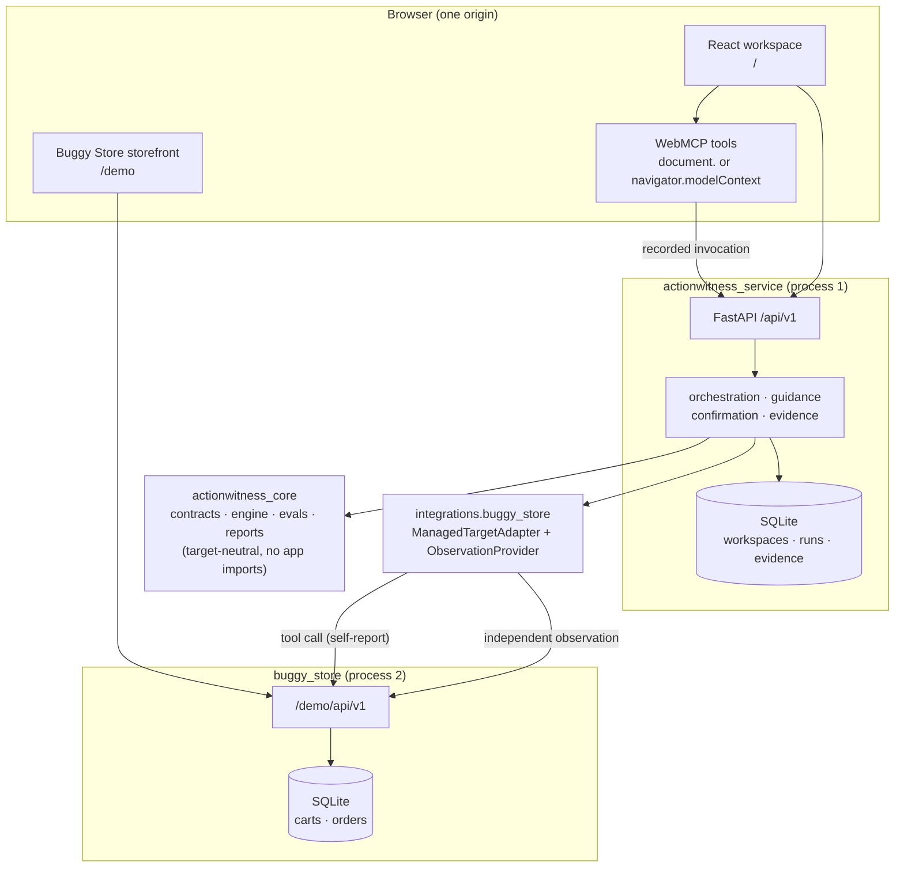

# ActionWitness

> The agent says it did the thing. **ActionWitness says what actually happened.**

An independent witness for WebMCP-enabled applications: it observes authoritative
business state around an agent's journey, holds that state to an explicit contract,
and turns every silent failure into a portable regression test.

Built for the [WebMCP Challenge](https://webmcp.devpost.com/) (submission Sep 3, 2026, 1:00 PM PDT).

**Live demo:** <https://actionwitness.onrender.com> — the workspace at `/`, the
Buggy Store at [`/demo`](https://actionwitness.onrender.com/demo), health at
[`/healthz`](https://actionwitness.onrender.com/healthz). No credentials, no
login; see [Deployment](#deployment).

> **If the first load is slow, it is waking up, not broken.** The instance runs on
> Render's free plan, which spins a service down after 15 idle minutes; the cold
> start that follows takes about 30 seconds, after which every request is fast.
> To warm it before you look at anything:
>
> ```bash
> curl -s -o /dev/null -w '%{http_code} in %{time_total}s\n' \
>   https://actionwitness.onrender.com/healthz
> ```
>
> `200` in well under a second means it is awake. Around 30 seconds means that
> request paid for the boot and the next one will be quick.
>
> `.github/workflows/keep-warm.yml` pings `/healthz` every five minutes to keep
> the spin-down from happening at all. Treat it as a convenience rather than a
> guarantee: GitHub delays scheduled runs under load, and on a private repository
> the schedule also draws from the Actions minute allowance and stops once that is
> spent. A deployment that must never cold-start needs a paid instance.

## The problem: a success response is not a correct outcome

WebMCP gives agents structured tools on real websites — a real improvement over
screenshot driving, and a guarantee of nothing about the business outcome. An
agent can select the right tool, pass the right arguments, receive a
syntactically valid `success`, watch the UI update — and still leave the
business wrong: a discount that reports success while the total never moves, a
cart mutation applied twice on a retry, a checkout that skipped its human
confirmation, a journey that half-commits (spec §2.1).

Existing WebMCP tooling rightly covers registration, schemas, tool selection,
argument matching, and invocation order. Every pass criterion in that stack
terminates at the tool's **self-reported response — the channel that can lie.**
ActionWitness treats that channel as evidence, never proof, and judges the run
on independently observed business state.

**And the failure mode is already in the field** (spec §2.3). From published
third-party reports, verified against primary sources on Aug 27, 2026 — full
citations and evidence tiers in
[`docs/storefront-witness.md`](docs/storefront-witness.md):

- Shopify's developer changelog (Aug 5, 2026) put WebMCP tools live by default
  on Liquid storefronts — ten tools including `update_cart` and
  `proceed_to_checkout`, nothing to install, and no documented Liquid opt-out.
- An independent tester (Aug 6, 2026) found live storefronts whose catalog
  reads returned correct structured data while add-to-cart, cart read, and
  checkout all failed on the same internal error — a read path that looks
  healthy over a write path that is silently broken.
- Developer reports (Jul 17, 2026) described the injected loader leaking
  globals and breaking unrelated storefront scripts, with three loader versions
  in roughly six weeks and no merchant-facing version pinning, testing surface,
  or monitoring.

The honest counterweight, in the same breath: WebMCP adoption outside
demonstrations is still very small, no mainstream agent consumed these tools in
production at the time of writing, and the injected script registers tools only
where `document.modelContext` already exists. The exposure is latent, not
realised — a risk that becomes live the day browser support becomes default.
No damage is claimed.

What remains either way: a population of site owners now carries an
agent-facing surface they did not author, cannot test, and cannot observe —
the audience the [audit feature](#auditing-a-storefront-you-did-not-build)
serves — and the observed shape is exactly this product's thesis: **the tool
says success, the authoritative state says otherwise, and nobody downstream
can tell.**

## The layered failure, on screen

Captured against the live deployment (§29.2). The workspace: the left rail
separates the workflow (contract → run → verdict → regression, with the
server's phase pinned "now") from administration, and the guidance banner
names whose turn it is and walks to the control that acts:


The agent's `apply_discount` call returns `success` and claims the discounted
total; the independently observed cart says the discount never landed — and
the run is judged on the difference:


A protected checkout pauses on a server-issued confirmation: the agent's call
is suspended until a person decides, with the consequence spelled out as
labelled rows, the verbatim payload one disclosure away, and a live expiry:


**Status.** Tiers 1–3 are implemented and tested: the target-neutral core, the
failure-injectable Buggy Store, the React/WebMCP workspace and human confirmation,
regression replay, evaluator import, self-witnessing, live Gemini variant drafting,
repeated-trial correlation, the operator-driven external audit, and the configured
Shopify development-store proof. The suite now contains 3,000+ deterministic Python
tests and 400+ frontend unit tests. Credentialed integrations remain optional and
fail closed when their exact server-side configuration is absent.

**Normative sources.** The functional specification is `docs/actionwitness-functional-spec.md`,
version 1.9; the implementation plan and milestone gates are `docs/BUILD_ORDER.md`.
Both live at those paths in a working tree but are deliberately untracked (see
`.gitignore`) — they are planning inputs held locally by the operator, not published
deliverables. Every in-repo `spec §N` citation refers to v1.9 of that file. The
per-milestone contracts derived from it are tracked under `specs/`.

---

## Contents

- [Why a witness](#why-a-witness)
- [60-second test](#60-second-test)
- [Architecture](#architecture) — full design account in [`docs/ARCHITECTURE.md`](docs/ARCHITECTURE.md)
- [Where the WebMCP code is](#where-the-webmcp-code-is)
- [Browser setup: Chrome and ChatGPT](#browser-setup-chrome-and-chatgpt)
- [Command surface](#command-surface)
- [Contracts, pre-fix/post-fix, and matched comparison](#contracts-pre-fixpost-fix-and-matched-comparison)
- [Human–agent guidance and confirmation](#humanagent-guidance-and-confirmation)
- [Regression evals: schema, runner, CLI](#regression-evals-schema-runner-cli)
- [Importing an external evaluator report (Tier 2)](#importing-an-external-evaluator-report-tier-2)
- [Auditing a storefront you did not build](#auditing-a-storefront-you-did-not-build)
- [Writing an adapter](#writing-an-adapter)
- [Deployment](#deployment)
- [Security and data handling](#security-and-data-handling)
- [What is not here](#what-is-not-here)
- [Version pinning](#version-pinning)
- [Provenance](#provenance)
- [Attribution](#attribution)
- [License](#license)

---

## Why a witness

A call-level evaluator asks *did the model call your tools correctly?* ActionWitness
asks the question that survives a green test suite: *did those calls leave the
business in the state the user asked for?* It watches through a channel the tool
does not control — canonical server state, or a platform's own session API — so a
tool that reports success while changing nothing has nowhere to hide.

> A call-level evaluator tests whether the model calls your tools correctly;
> ActionWitness tests whether your tools did what they claimed. **Run both.**

It imports and correlates results from the pinned Google `webmcp-evals` reporter
into a dual-layer benchmark (spec §9.9). It never reimplements that evaluator and
is never a replacement for it.

**Where the existing stack stops** (spec §2.2; positioning baseline
`GoogleChromeLabs/webmcp-tools` at `d39eae4`, Aug 27, 2026):

| Component | What it verifies | Its pass criterion stops at |
|---|---|---|
| `webmcp-evals` `local` mode | LLM tool selection, arguments, order vs a static schema | No execution — results are authored `mockOutput` values |
| `webmcp-evals` `browser` mode | Selection, arguments, order, optional `result` matchers on a live page | The tool's self-reported return value |
| `webmcp-evals` `smoke` mode | Deterministic execution of authored call lists | Executes without self-reporting failure |
| `webmcp-studio` | Generated tool code and evaluator cases | Authoring aid — verifies nothing at runtime |
| Inspector, demos, polyfill | Registration inspection, sample targets | No backend, no state verification |

No component in that stack captures an independent business-state observation,
evaluates before/after assertions, counts state changes across retried
requests, correlates consent evidence with protected mutations, classifies a
success response that contradicts authoritative state, or derives a replayable
regression case from a failed run. That system — the contract schema with
policies, independent observation providers, the hashed immutable evidence
chain, deterministic fixture replay, and the dual-layer correlation protocol —
is the durable differentiation, not the bare idea of checking state.

Two distinctions worth stating up front (spec §2.2):

- `webmcp-evals` **smoke mode** executes authored calls against a live page and
  passes on execution success. The ActionWitness replay runner executes a
  *failure-derived* case against a *restored fixture* in an isolated workspace and
  passes on *business-outcome expectations* with classification fidelity.
- A `result` matcher reads the same channel that can lie. ActionWitness observation
  providers (canonical target state, Shopify same-session Cart API) are independent
  of tool-return text by construction.

## 60-second test

The point of this run is one screen: a tool call that **returns success** and a
verdict that says the business outcome **failed anyway**.

```bash
git clone <this repository> && cd actionwitness
uv sync                                    # ~20s
uv run pytest tests/integration/test_false_success.py -q
```

That test arms the §10.1 cart contract against the Buggy Store in `pre_fix`, applies
a discount through the recorded tool surface, and asserts three things at once: the
tool reported `status: success`, the independently observed cart total did not move,
and the run classified as `false_success_or_state_mismatch` with execution and
trajectory layers *passing*. Flip the scenario to `post_fix` and the same journey
passes.

To see it in a browser instead, run the two processes and open the workspace:

```bash
uv run buggy-store &                                        # target on :8001
uv run uvicorn actionwitness_service.api.app:create_app --factory --port 8000 &
cd apps/actionwitness_service/frontend && npm ci && npm run dev
```

Then open the printed Vite URL. The workspace runs without WebMCP — every step has
a human control — and reports browser tool support as a fact rather than a
requirement (AC-09).

## Architecture

The diagram and layout below are the orientation. **`docs/ARCHITECTURE.md` is the
full account** — why the layers are shaped this way, how each invariant is
mechanically enforced rather than documented, where the WebMCP surfaces are, the
evidence and consent models, and a candid list of the system's known limits.



The two arrows from the adapter to `/demo/api/v1` are the product. One carries the
tool call whose result is *evidence*; the other is a separate authoritative read
whose result is *proof*. They are never the same response — a successful tool
response is never persisted as observed state (constitution §4).

### Repository layout (spec §18)

    packages/actionwitness_core      target-neutral assurance library (no app/demo/vendor imports — enforced)
    apps/actionwitness_service       FastAPI app, orchestration, guidance, persistence, CLI, React frontend
    integrations/buggy_store         core ports <-> Buggy Store versioned HTTP API + WebMCP bridge
    integrations/google_evals        pinned report adapter plus the credential-gated Gemini REST variant client
    integrations/self_target         self-witness adapter and observer, restricted to the public HTTP API
    integrations/shopify             external-audit pack plus the configured cart-only development-store adapter
    examples/buggy_store             independently runnable demo target (no assurance-stack imports — enforced)
    shopify_bridge                   reviewed theme bridge for same-session Cart API observation
    tests/                           architecture, unit, integration, adapters, contracts, evals lanes

Dependency direction is enforced, not documented. `actionwitness_core` imports no
application, integration, demo, evaluator-vendor, or commerce module, and the demo
target imports nothing from the assurance stack:

```bash
uv run pytest tests/architecture/test_import_boundaries.py -q   # forbidden-import gate
uv run python scripts/core_only_isolation.py                    # core installs and tests ALONE
uv run python scripts/store_only_isolation.py                   # store installs and runs ALONE
```

The last two build a fresh virtualenv and install exactly one distribution into it.
They are the only proof that "installs with every other package absent" is true
rather than intended.

## Where the WebMCP code is

§29.2 asks for this explicitly, because "we use WebMCP" is not a location.

| Style | File | What it does |
|---|---|---|
| **Native** (`registerTool` on the resolved model context) | `apps/actionwitness_service/frontend/src/webmcp/adapter.ts` | The **only** file that touches the WebMCP API, and the only one that knows *where* it lives: `resolveModelContext()` tries `document.modelContext` then `navigator.modelContext`, because ADR-0002's spike saw both and the attested build exposed one. Owns registration, StrictMode-safe cleanup, error normalization, and the cancellation-sensitive direct path (ADR-0002 rule 3) — `get_workspace_status` and the toolsets that must observe a cancelled invocation register this way. |
| **Hook-based** (`use-webmcp-tool@0.2.0`) | `apps/actionwitness_service/frontend/src/webmcp/adapter.ts` (`useWebMCP`, wrapped) | The pinned lifecycle package registers the standard toolsets, wrapped by the adapter so nothing else learns its API. Not used for cancellation-sensitive tools — no path in the tested build forwards the per-invocation signal. The ADR-0002 selection spike that pinned it is preserved at `src/spike/hookPath.tsx`. |
| **Declarative** (`toolname` on a `<form>`) | `apps/actionwitness_service/frontend/src/components/ContractForm.tsx`, attributes owned by `useDeclarativeTool` in `adapter.ts` | `create_outcome_contract` (§25.2, FR-021): the browser reads the tool off the form's own markup, so the agent's affordance and the person's are the same DOM node, and both submit through one handler. Flat scalars only — the form cannot author assertions or policies. |
| Harness tool definitions | `apps/actionwitness_service/frontend/src/tools/harnessTools.ts` | 15 phase-derived tools: `list_contract_templates`, `get_outcome_contract`, `arm_outcome_contract`, `verify_outcome`, `get_run_findings`, `reset_workspace`, `create_regression_eval`, `run_regression_eval`, `get_run_timeline`, `get_run_comparison`, `list_regression_evals`, `list_audit_packs`, `get_audit_report`, `list_benchmarks`, `get_benchmark_summary` |
| Target tool definitions | `apps/actionwitness_service/frontend/src/integrations/buggyStore/tools.ts` | `search_catalog`, `get_cart`, `update_cart`, `apply_discount`, `proceed_to_checkout` |

The tool set changes with workspace state (spec §11.5), so which tools are callable
is a function of the phase — see [guidance](#humanagent-guidance-and-confirmation).

**No Python-side WebMCP registration exists, by rule.** Browser registration lives
in the TypeScript adapter; the Python side records invocations that arrive through
`/api/v1`.

## Browser setup: Chrome and ChatGPT

WebMCP is behind a flag in the tested build.

1. Chrome 151 stable. Open `chrome://flags/#enable-webmcp-testing`, set it to
   **Enabled**, and relaunch.
2. Open the workspace. The capability bar reports whether WebMCP was found **and
   where** — "available (via `document.modelContext`)". The adapter resolves the
   API from `document.modelContext` first and `navigator.modelContext` second,
   because the 2026-08-31 spike saw it at both while the build used for the
   2026-09-03 deployed attestation exposed only the first. A browser that keeps
   it on `navigator` alone is supported and says so; naming the location is what
   makes "works in Chrome, not in the in-app browser" a report somebody can act
   on rather than a shrug.
3. Drive the tools from the ChatGPT in-app browser, or from Chrome DevTools —
   note `executeTool` takes the registered tool *object* and a JSON *string*
   (verified live against the deployed workspace, 2026-09-03). Use whichever
   location the capability bar named:

   ```js
   const mc = document.modelContext ?? navigator.modelContext;
   const tools = await mc.getTools();
   const status = tools.find((t) => t.name === "get_workspace_status");
   await mc.executeTool(status, "{}");
   ```

**Arriving from a link inside ChatGPT mints a fresh workspace.** The workspace
cookie is `SameSite=Strict` unconditionally (FR-005, §20.1), so it is not sent on
a cross-site navigation *into* the origin — the first request after following a
link carries no cookie and is issued a new workspace, and every request after it
carries the new one. That is the strict-cookie policy working as specified, not a
bug: open the URL directly, or expect to start a fresh workspace on arrival.

If WebMCP is absent the workspace still works end to end — that is AC-09, and it is
tested (`panels.test.tsx`, "reports a browser without WebMCP as a fact, not a
failure"). Nothing in the human path requires a browser agent.

## Command surface

These are the only commands the project supports; CI runs exactly these names
(`.github/workflows/ci.yml`, spec §26). No linting framework beyond `ruff` is used
on the Python side.

### Python — from the repository root

| Command | Purpose |
|---|---|
| `uv sync` | Resolve and install the `uv` workspace (all members + dev group) |
| `uv run pytest -q` | Full Python suite — every lane under `tests/` |
| `uv run pytest tests/architecture -q` | Architecture gates (forbidden imports, layering, isolation, release hygiene) — spec §26.7 |
| `uv run python scripts/core_only_isolation.py` | Install ONLY `actionwitness_core` in a clean venv and run its suite there (AC-19) |
| `uv run python scripts/store_only_isolation.py` | Install ONLY the Buggy Store in a clean venv, run a real storefront journey, and run its suite there (AC-19) |
| `uv run python scripts/scan_for_secrets.py` | Secret-shape scan over tracked files (CI gate) |
| `uv run ruff format --check .` | Formatting gate (add `--diff` to see it; drop `--check` to apply) |
| `uv run ruff check .` | Lint gate (`--fix` to apply safe fixes) |
| `uv run buggy-store` | Run the demo target alone on `:8001`, with no assurance package involved |

One generator is part of the surface:

| Command | Purpose |
|---|---|
| `uv run python -m actionwitness_service.api.registry_export` | Regenerate the shared name registry the frontend imports |

The registry (`apps/actionwitness_service/frontend/src/generated/registry.json`)
is the single source of stable API error codes and closed state/event enums, so
handlers, UI, and tests cannot fork names. It is committed; `uv run pytest -q`
fails if it drifts from its Python source.

`pytest` markers select a lane inside the full run, e.g. `uv run pytest -q -m architecture`.
Registered markers: `architecture`, `unit`, `integration`, `adapters`, `contracts`,
`evals`, `benchmarks`, `guidance`, `shopify`, `browser`.

### Frontend — from `apps/actionwitness_service/frontend`

| Command | Purpose |
|---|---|
| `npm ci` | Install from the committed lockfile |
| `npm run typecheck` | **Strict `tsc --noEmit`.** A Vite build is bundling only and is *not* type-check coverage |
| `npm run lint` | ESLint (type-checked rules, hooks, jsx-a11y) |
| `npm test` | Vitest (jsdom) — adapter lifecycle, polling, panels, confirmation |
| `npm run build` | Vite production bundle |
| `npm run typecheck:e2e` | Strict `tsc --noEmit` over the browser lane's own sources |
| `npm run test:e2e` | **Tier 3, opt-in.** Playwright against the composed deployment — see below |

#### The automated browser lane (Tier 3, never release-gating)

`npm run test:e2e` builds the one-origin tree spec §29.1 describes, starts both
application processes, and drives the harness UI, the storefront, and the WebMCP
tool surface in a real browser. It covers the seam nothing else reaches: the
Python suite never opens a browser, and the jsdom suite stubs `fetch` and owns
its own `document.modelContext`.

Spec §26 makes this tier **conditional** — "their absence shall never fail the
release-gating suite" — so it is outside `uv run pytest -q`, outside `npm test`,
outside `npm run typecheck`, and outside every CI job. `tests/browser/` remains
the manual §26.4 checklist it was, and this lane does not replace it: Chromium
ships no WebMCP without the flag ADR-0002 pins, so the registry is substituted
while everything above and below it is production code.

Requires `npx playwright install chromium` once. Working files land in
`apps/actionwitness_service/frontend/.e2e/` and are git-ignored.
`apps/actionwitness_service/frontend/e2e/README.md` documents what each spec
holds and why the lane respects FR-009's rate limits rather than relaxing them.

### Storefront frontend — from `examples/buggy_store/frontend`

The demo target's own human UI. Built and tested independently of the harness
frontend (spec §29.1), and deliberately free of WebMCP: this is the storefront a
person uses when no agent, no harness, and no browser-tool support is present
(AC-09).

| Command | Purpose |
|---|---|
| `npm ci` | Install from the committed lockfile |
| `npm run typecheck` | **Strict `tsc --noEmit`.** Separate gate from the build |
| `npm run lint` | ESLint, mirroring the harness rules |
| `npm test` | Vitest (jsdom, no `document.modelContext` by design) |
| `npm run build` | Vite production bundle |
| `npm run dev` | Serve the storefront, proxying `/demo` to a local store on port 8001 |

Both lockfiles are committed; `npm ci` is the reproducible install path for each
frontend. The harness tree records the ADR-0002 pin (`use-webmcp-tool@0.2.0`).

## Contracts, pre-fix/post-fix, and matched comparison

An **outcome contract** states what must be true of authoritative business state
after a journey — preconditions, expected tools, and assertions with `critical` or
`warning` severity (spec §9.4, §10.1). Built-in templates are seeded at startup by
the integration that owns them; a workspace selects one and arms a run against it.

**`pre_fix` / `post_fix` are demo profiles, not a deployed patch.** The Buggy Store
ships with injectable failure profiles (spec §13.3). `pre_fix` activates one —
`apply_discount` reports success and persists nothing. `post_fix` runs the same code
path with the fault inactive. Switching between them changes *the demo target's
configuration*, and nothing about ActionWitness is patched, rebuilt, or reconfigured
in between. Anyone reading a `pre_fix` failure as "a bug we fixed" has it backwards:
the fault is deliberate, permanent, and the point.

**Matched comparison** (spec §12): two runs are comparable only when their contract,
target, scenario, and fixture agree. A rerun that differs in any of those stays a
valid run and reports `not_comparable`, naming the differing fields, rather than
producing a misleading delta.

## Human–agent guidance and confirmation

Every nonterminal workspace state produces exactly one `GuidanceState` naming one
actor and one next action (FR-120). The phases are
`no_contract`, `proposing`, `candidates`, `contract_ready`, `armed`, `running`,
`awaiting_confirmation`, `verifying`, `passed`, `passed_with_warnings`, `failed`,
`eval_ready`, `eval_running` (spec §11.5). The banner, the controls, the tool
`next_action`, and the action history all name the same action code at every
transition — asserted end to end in `tests/integration/test_006_exit_gate.py`.

**Protected actions require a server-issued human confirmation** bound to the
workspace, run, action, arguments, and expiry. An agent cannot create, broaden, or
approve its own consent. The dialog preselects neither choice, traps and restores
focus, and is rebuildable after a page refresh. Denial, expiry, and cancellation
each create no order — and one approval produces exactly one order, tested in
`tests/integration/test_journey_b.py`.

**Cancellation and recovery.** In-flight work is cancellable; obsolete polling
responses are ignored rather than applied; a partially completed operation stays
visible instead of being silently retried. Every one of those has a test.

**Manual equivalent.** Every agent-operable step has a human control that reaches
the same endpoint. The journey needs no browser agent
(`test_gate_2_the_whole_journey_needs_no_browser_agent`).

## Regression evals: schema, runner, CLI

A failed run can be turned into a portable regression case: fixture, trajectory,
and outcome expectations, redacted and content-hashed (spec §24).

- **Published schema:** `packages/actionwitness_core/src/actionwitness_core/evals/regression_eval_case_1_0.json`
- **Runner:** `actionwitness_core.evals` (pure, synchronous, deterministic) driven by
  `actionwitness_service.application.eval_runner`
- **A sample case** is produced by
  `uv run pytest tests/integration/test_eval_case_generation.py -q`, or by
  `create_regression_eval` from a failed run in the UI, and downloaded from
  `GET /api/v1/evals/{case_id}/case.json`.

```bash
uv run actionwitness eval validate path/to/case.json
uv run actionwitness eval run path/to/case.json --environment current
uv run actionwitness eval run path/to/case.json --environment reproduce_source
```

Exit codes are fixed by FR-088 and are the CI contract:

| Code | Meaning |
|---|---|
| `0` | Replay matched the case's outcome expectations |
| `1` | Replay ran and **differed** — an unrelated or additional critical classification |
| `2` | The case is invalid, or the harness could not execute it. Never `1`: nothing was replayed, so there is no expectation to differ from |

`--environment reproduce_source` replays against the implementation the case was
generated from and must reproduce the original failure and the exact critical set.
`current` replays against today's code and is the regression gate.

## Importing an external evaluator report (Tier 2)

ActionWitness correlates the pinned Google `webmcp-evals` reporter's output with its
own outcome layer, producing a dual-layer benchmark (spec §9.9, §25.3). It never
re-implements that evaluator.

```
POST /api/v1/benchmarks/{benchmark_id}/imports
```

- **Pinned evaluator:** `webmcp-evals@0.0.4` (`fe33c1b`) — see ADR-0005
- **Checked-in redacted fixture:**
  `integrations/google_evals/fixtures/tier2_three_scenarios.json`, used by the
  import and correlation tests (`tests/integration/test_008_exit_gate.py`)
- **Binding rules:** binding is **explicit** and fails closed on weak addressing. A
  trial is bound to a run only by an unambiguous identifier; a report that cannot be
  bound is reported as unbound rather than guessed at. This matters because the
  upstream reporter does not yet emit a stable trial ID — the correlation would
  otherwise be a heuristic presented as a fact.
- **Untrusted by construction:** an imported report is validated for size and
  allowlisted schema before parsing, all displayed text is escaped, executable or
  HTML content is rejected, and replay is limited to allowlisted target tools.

_Upstream stable-trial-ID reporter issue: **drafted, not filed** — the text is
kept with the decision records outside this repository (see below), verified
against `webmcp-evals` v0.0.4 (`fe33c1b`). Filing is an outward-facing act on another
project's repository and is the operator's call (spec §25.3, ADR-0005)._

## Auditing a storefront you did not build

Some storefronts have agent tools on them that their owners never installed and
cannot test. Storefront Witness audits one such surface — a single origin the
operator asserts they are authorized on — and returns a report written for the shop
owner: which agent tools work, which report success while the store does not change,
which were deliberately left alone, and what to fix first.

```
GET  /api/v1/audits/packs             # the built-in contract packs, offered (FR-161)
POST /api/v1/audits                   # assert one authorized origin
GET  /api/v1/audits/current           # the live audit, or an explicit null
POST /api/v1/audits/current/evidence  # the pass: browser transcript in, sealed report out
GET  /api/v1/audits/current/report    # the sealed report, re-verified before it is served
POST /api/v1/audits/current/cancel    # release the workspace's one live-audit slot
```

An audit now **finishes**. The submission classifies the browser's transcript
(`pack_id`, the `getTools()` enumeration, what each exercised tool claimed, and the
raw cart reads before and after), composes the merchant report, writes it as a
content-addressed artifact (ADR-0007), and moves the audit to §22's terminal `completed` in the
same transaction that records the artifact row — so the next audit is no longer
blocked behind the 24-hour workspace sweep. `cancel` is the other exit, for an
audit begun against the wrong origin.

**The operator journey is in the workspace.** The left rail's **Audit → External
surface** view walks it: assert one authorized origin behind an explicit
affirmation, choose a pack (offered, never auto-selected), copy the generated
collector, run it on the storefront you are authorized on, paste the transcript
back, and read the merchant report.

The collection step is a snippet rather than a button, and that is the boundary
rather than a shortcut: a document can enumerate only its **own**
`modelContext`, and `cart.js` is a read of the caller's **own** session, so
neither crosses an origin — and the one arrangement that would appear to, a
server-side fetch, is exactly what §12.17 forbids. The collector is generated
from the chosen pack, so FR-162's never-invoked tools are excluded by
construction rather than by the reader remembering.

- **Off unless configured.** `external_audit` ships disabled, so an anonymous
  workspace can never assert authorization for an origin the deployment did not
  allowlist (`EXTERNAL_AUDIT_ALLOWED_ORIGINS`, server-controlled).
- **The packs are offered, never chosen for you.** `match_pack` returns every pack
  a surface satisfies and picks none, and the submission must name one — choosing
  on the operator's behalf would decide, against a storefront somebody depends on,
  whether a write path gets exercised.
- **A submission is size-capped before it is parsed** (FR-117, 256 KiB). The cart
  payload is the one part of the request the audited storefront controls rather
  than the operator, so the bound precedes the JSON parser rather than sitting
  behind it as a validator.
- **An unread channel is never a pass.** Absent observations arrive as `null` and
  every exercised tool is classified `unobserved` — §12.17's
  `observation_unavailable`. A *malformed* read is refused as a 422 instead, because
  a broken submission and an unobservable storefront are different facts.
- **A tampered report is refused, not served.** The stored document is re-verified
  against its recorded hash on every read, and the refusal names neither the path
  nor the hash — together they are what a forger would need.
- **One origin, never a list.** The request model has no field that accepts a
  collection. There is no crawler and no discovery path.
- **The harness makes no request to the audited site.** The independent cart read
  happens in the operator's own browser, through the platform's session API. No
  module in the audit imports an HTTP client, which is asserted in the architecture
  lane rather than promised in a comment.
- **Never checkout, never an order.** `proceed_to_checkout` and `manage_orders` are
  reported as present and reachable, and no shipped contract pack can dispatch them.
- **A pass is evidence, not a warranty.** The report states its own limits.

The context this feature was built for — and the specific claims this project does
and does not make about it — is `docs/storefront-witness.md`. The public findings
cited there are **published third-party reports**, attributed and dated; ActionWitness
has scanned no brand it does not own.

## Writing an adapter

Three protocols in `packages/actionwitness_core/src/actionwitness_core/ports/__init__.py`:

| Protocol | Responsibility |
|---|---|
| `TargetAdapter` | Publishes a tool surface and executes an invocation |
| `ManagedTargetAdapter` | …plus `prepare`: restore a fixture and select a scenario. For targets the harness controls |
| `ExternalTargetAdapter` | For targets it does not. Cannot restore fixtures; forbidden operations refuse explicitly |
| `ObservationProvider` | Reads authoritative state through a channel independent of tool responses |

A **minimal non-commerce example** lives in
`tests/adapters/test_non_commerce_adapter.py` — a fake target with no cart, no
money, and no product, evaluated end to end through the same core interfaces. It
exists to prove the core is target-neutral rather than commerce software with the
labels changed.

**Supported external target scope.** Exactly one: an authorized Shopify development
store, one server-configured variant and currency, and cart-only behavior. The
adapter and `/api/v1/shopify` pairing routes become available only when all four
exact deployment values are valid; otherwise the module reports a bounded disabled
or misconfigured state and the Buggy Store path remains unaffected. Every other
external target is roadmap scope, not V1. The audit surface above is different: it
observes a storefront through the operator's browser and drives no target adapter.

## Deployment

One Render web service, one Docker image, one origin (spec §29.1, ADR-0006).

```bash
docker build -t actionwitness .
docker run --rm -p 8000:8000 -e HARNESS_PUBLIC_ORIGIN=http://localhost:8000 actionwitness
```

- `/` — harness workspace `/api/v1` — harness API
- `/demo` — Buggy Store storefront `/demo/api/v1` — Buggy Store API
- `/healthz` — liveness, plus `public_origin`, `assets_mounted`, `schema_version`,
  `database` (`ok` / `unavailable`) and `origin_policy` (`configured` /
  `unconfigured`)

The image runs **two processes in two virtualenvs**: the store never shares an
environment with the assurance stack, and the only route between them is the
versioned HTTP API on loopback. `--workers 1` is load-bearing — ADR-0003's SQLite
lock model assumes a single writer, so a second worker is a correctness change.
ADR-0006 records the whole composition and what it costs.

`HARNESS_PUBLIC_ORIGIN` must be the **exact deployed origin**. It drives both the
cookie's `Secure` attribute and the origin allowlist; set it wrong and the service
comes up healthy while refusing every mutation. `/healthz` reports the value it
resolved, which is how you find that mistake in seconds instead of an hour.

That check is not merely descriptive. `/healthz` answers **503** with
`"status": "degraded"` when the database cannot be read, or when a *production*
deployment has no valid `HARNESS_PUBLIC_ORIGIN` — in which case `OriginPolicy`
falls back to comparing each request against its own origin, which is the right
default for documented local development and an allowlist of whatever the caller
claims anywhere else. The database probe reads a real table on every call rather
than reporting a value captured at startup, because SQLite happily creates an
empty database for a path that no longer exists and a `SELECT 1` would answer
just as cheerfully from the file it had silently made. A red health check holds
the new deploy back and leaves the previous one serving, which is why this is
reported rather than made a crash on boot.

Environment variables are documented in
`apps/actionwitness_service/src/actionwitness_service/config.py` and `.env.example`.

## Security and data handling

**Threat boundary.** Everything crossing into the service is untrusted: HTTP
bodies, WebMCP arguments and results, imported evaluator reports, URLs, and adapter
responses. Python boundaries are explicit Pydantic models that forbid unknown
fields; TypeScript receives external values as `unknown` and narrows them at
runtime.

- **No credential is needed to run the demo.** The Buggy Store path uses none.
  Model-provider credentials belong to the pinned evaluator's own process
  environment (FR-099) and are never in the Docker image, the frontend bundle, the
  health response, logs, evidence, or fixtures. Configuration records the *name* of
  a credential variable, never its value.
- **Anonymous workspaces.** A cryptographically random cookie, `HttpOnly` and
  `SameSite=Strict` always, `Secure` outside documented local HTTP development. It
  is an isolation boundary; a `workspace_id` from a tool argument is never an
  authorization mechanism.
- **Origin validation** on every mutating request, compared for equality after
  normalization — no prefix or suffix matching.
- **`Permissions-Policy: tools=(self)`** and `Origin-Agent-Cluster: ?1` (spec §20.1).
  No CORS is offered to any origin; the frontend and API are same-origin by design.
- **A strict `Content-Security-Policy`** — `default-src 'none'` with `'self'` for
  scripts, fetches, styles and fonts, and no `'unsafe-inline'` or `'unsafe-eval'`.
  It is safe to be that strict because the bundle shape it assumes is asserted:
  `tests/architecture/test_bundle_shape.py` fails if either frontend gains an
  inline script, an inline style, CSS-in-JS, `eval`, or an off-origin asset.
- **Rate limits** keyed on the direct peer, or on trusted-proxy metadata only when
  the peer is an operator-configured proxy. An arbitrary client-supplied forwarding
  header is ignored.
- **Structured logs carry identifiers, status, duration, and classification —
  never payloads.** The log model has a closed field set, so there is no `extra`
  dict to slip a value into, and an unmatched request path is reduced to a sentinel
  rather than logged raw.
- **Evidence is append-only, canonically serialized (RFC 8785), and hash-linked.**
  Verification failure produces an explicit non-pass; it never degrades to success.
  Artifact files are named after the digest of their own document and written
  atomically, so a committed row can never come to describe bytes that were
  overwritten or half-written — ADR-0007 records the two defects that made that
  necessary, and there is one verification implementation rather than one per
  reader.
- **Data retention.** Demo data is ephemeral. Stale workspaces are swept at startup
  and hourly. Nothing personal is requested or required.

Report a security issue by opening an issue without exploit detail, and we will
arrange a private channel.

## Optional modules and deliberate limits

Named, not hidden. Each configuration-gated module reports its current state and a
human-readable reason at `GET /api/v1/workspace` under `modules`.

| Module | State | Why |
|---|---|---|
| `shopify` | **off by default** (Tier 3, optional) | Implemented and tested. It enables only for one exact authorized development-store origin, one server-controlled variant, one currency, and the exact harness origin. Without all four values, no pairing can start. |
| `live_evaluator` | **off by default** (Tier 3, optional) | The Gemini REST drafting client is implemented, but live generation needs an explicitly enabled provider/model and a server-side credential. Recorded fixtures remain usable and are labelled `recorded_fixture`, never `live_model_run`. |
| `external_audit` | **off by default** (Tier 3, optional) | Implemented and tested; an anonymous workspace must never direct an audit at an origin the deployment did not allow. Enabling it requires `EXTERNAL_AUDIT_ALLOWED_ORIGINS` plus the operator's per-audit authorization assertion. |

Other known limitations:

- **SQLite, single worker, single instance.** Correct for the MVP and stated as a
  constraint rather than a default. Horizontal scaling needs a different store.
- **Ephemeral demo data.** A redeploy restarts from a seeded state.
- **Declarative WebMCP annotation covers one form.** The contract form is the
  only declarative tool; every other registration is imperative through the
  adapter.
- **The `/demo` proxy buffers**, capping a storefront request body at 64 KiB.
- **The demo video is not yet linked from this README.** It is recorded against
  the deployed URL; the layered-failure screenshots above already are.
- **The store process is not supervised.** If it exits, the harness stays up and
  `/demo/api/v1` answers a named `TARGET_UNAVAILABLE` until the container restarts.

## Version pinning

Filled from the §25.1 spike run of 2026-08-31; full readings and the decision
rule are in ADR-0002. Re-run the spike
(`npm run dev`, open **`/spike.html`**) before changing any row.

| Item | Pinned value |
|---|---|
| Chrome build + flag/origin-trial config (`chrome://flags/#enable-webmcp-testing`) | Chrome 151.0.0.0 stable (Windows), flag **Enabled** |
| WebMCP API location | The adapter resolves callable `document.modelContext` first and `navigator.modelContext` second. The 2026-09-03 deployed Codex browser exposed only the document location. |
| `getTools()` / `toolchange` | The deployed surface exposes `getTools()` but not EventTarget-style `addEventListener`/`removeEventListener`. ActionWitness therefore re-reads the snapshot at verification; live `toolchange` observation is used only when the host actually provides it. |
| Hook package (`use-webmcp-tool` vs `usewebmcp` spike decision) | `use-webmcp-tool@0.2.0` (exact); cancellation-sensitive tools use direct native registration — no path in this build forwards the per-invocation signal |
| `webmcp-types` version | `0.1.5` (exact) |
| `webmcp-evals` package + reporter schema + normalizer version | `webmcp-evals@0.0.4` (`fe33c1b`); explicit binding, fail-closed on weak addressing (ADR-0005) |
| Primary demo client / fallback | ChatGPT in-app browser / Chrome 151 + `#enable-webmcp-testing` + DevTools (LD-18) |

Decisions are recorded as numbered ADRs. **The records themselves are kept
outside this repository at the operator's direction**, so the `ADR-000N`
references here and throughout the source name a decision rather than a file you
can open from a clone.

## Provenance

All WebMCP-facing work in this repository — the browser adapter, the tool surfaces,
the harness, the demo target, the evals, and the service — was written during the
challenge's eligible implementation period (from 2026-08-27, the date the project
took its current name). There are no pre-existing assets carried in beyond the
open-source dependencies listed below.

## Naming

"ActionWitness" is the project name as of Aug 27, 2026. PyPI distributions are
`actionwitness-core`, `actionwitness-service`, and `actionwitness-integration-*`;
the CLI is `actionwitness`. Unrelated to the similarly-named `mcpact` project
(contract testing for MCP *servers*), which occupies a different layer.

## Attribution

ActionWitness is Apache-2.0. It builds on, and requires the notices of:

| Component | License | Role |
|---|---|---|
| [FastAPI](https://github.com/fastapi/fastapi), [Starlette](https://github.com/encode/starlette), [Uvicorn](https://github.com/encode/uvicorn) | MIT / BSD-3-Clause | Service boundary and ASGI server |
| [Pydantic](https://github.com/pydantic/pydantic) | MIT | Boundary validation |
| [HTTPX](https://github.com/encode/httpx) | BSD-3-Clause | Adapter and proxy transport |
| [aiosqlite](https://github.com/omnilib/aiosqlite) | MIT | Async SQLite driver |
| [React](https://github.com/facebook/react) | MIT | Workspace UI and storefront |
| [Vite](https://github.com/vitejs/vite), [Vitest](https://github.com/vitest-dev/vitest) | MIT | Frontend build and tests |
| [TypeScript](https://github.com/microsoft/TypeScript), [ESLint](https://github.com/eslint/eslint), [typescript-eslint](https://github.com/typescript-eslint/typescript-eslint) | Apache-2.0 / MIT | Frontend type-check and lint |
| [`use-webmcp-tool`](https://www.npmjs.com/package/use-webmcp-tool), [`webmcp-types`](https://www.npmjs.com/package/webmcp-types) | MIT | WebMCP lifecycle hook and types (ADR-0002) |
| [`webmcp-evals`](https://github.com/webmachinelearning/webmcp) (Google) | Apache-2.0 | The pinned call-level evaluator whose reports are imported — complemented, never reimplemented (ADR-0005) |
| [pytest](https://github.com/pytest-dev/pytest), [ruff](https://github.com/astral-sh/ruff), [uv](https://github.com/astral-sh/uv) | MIT / Apache-2.0 | Python test, lint, and packaging toolchain |

RFC 8785 (JSON Canonicalization Scheme) is implemented from the specification; see
ADR-0004.

## License

Apache-2.0 — see `LICENSE`.
