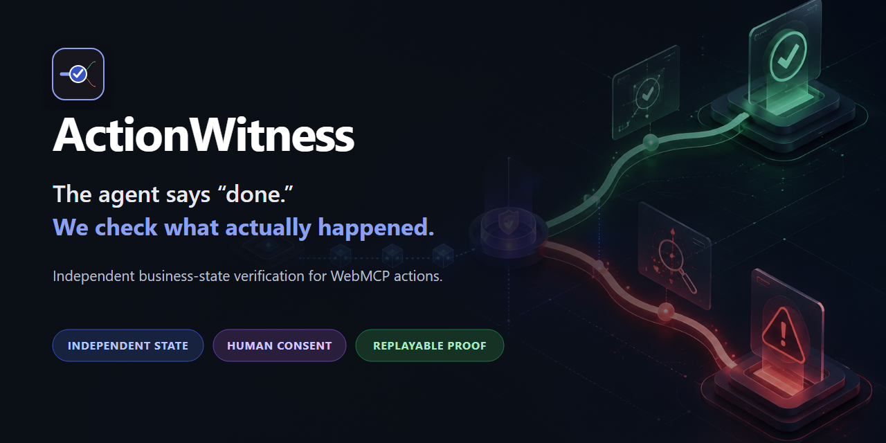
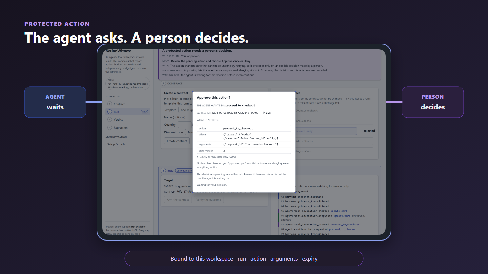
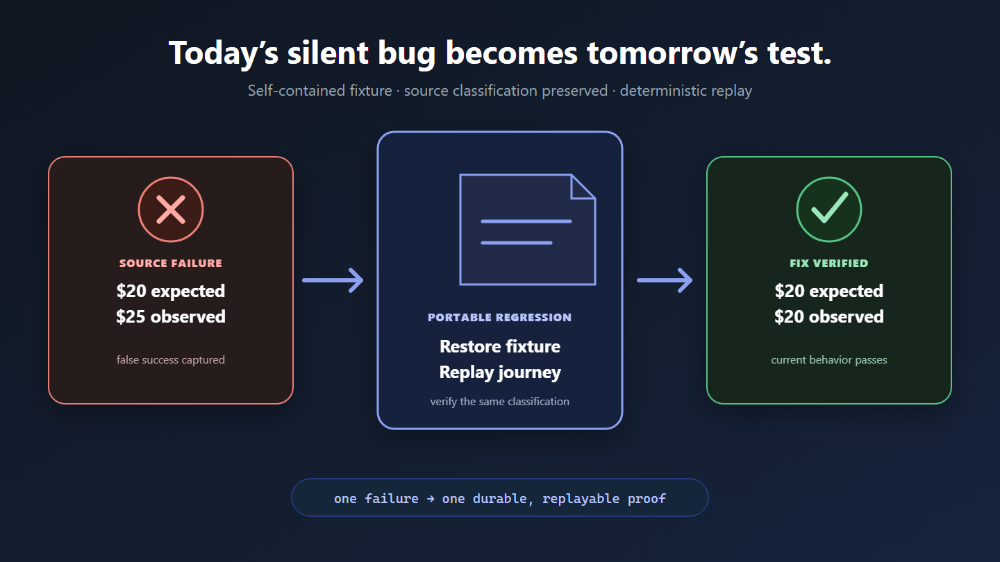
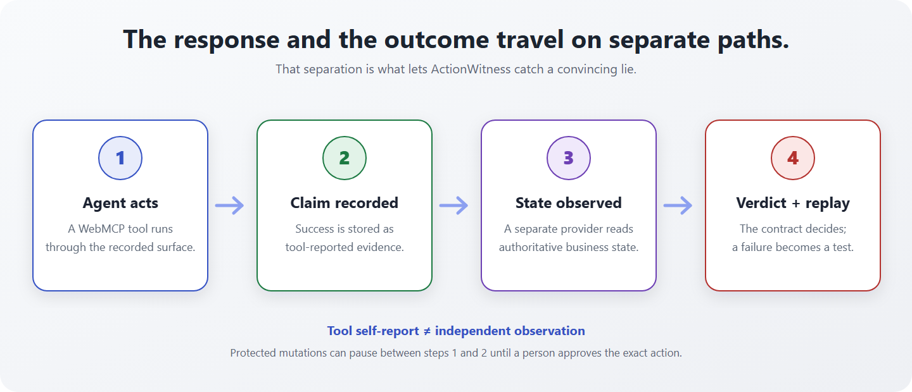

<p align="center">
  
</p>

# ActionWitness

> Your agent says “done.” ActionWitness checks the truth—verifying WebMCP actions
> against real business state, requiring human approval, and turning silent failures
> into replayable tests.

<p align="center">
  <a href="https://github.com/ichiorca/actionwitness/actions/workflows/ci.yml"></a>
  
  
  <a href="LICENSE"></a>
</p>

[](videos/actionwitness-demo/renders/video.mp4)

**[Watch the 60-second demo](videos/actionwitness-demo/renders/video.mp4)** ·
**[Try it live](https://actionwitness.onrender.com)** ·
**[Follow the judge runbook](docs/JUDGE_DEMO.md)** ·
**[Inspect the evidence](docs/SUBMISSION_EVIDENCE.md)** ·
**[Explore the visual architecture](docs/ARCHITECTURE.md)**

Built for the [WebMCP Challenge](https://webmcp.devpost.com/). The public demo
needs no account or credential. Its free instance can take about 30 seconds to
wake after being idle; the recorded demo is the deterministic fallback.

## The one-minute proof

The headline failure is deliberately small and impossible to explain away:

1. Open the [ActionWitness workspace](https://actionwitness.onrender.com) and the
   [Buggy Store](https://actionwitness.onrender.com/demo) side by side.
2. In **Setup & tools**, choose `pre_fix` and
   `discount_reported_but_not_applied`. Select the
   `one-mug-save20-no-checkout` contract and arm it.
3. In a WebMCP-capable browser, ask the agent:

   > Search for a mug, add one mug, apply `SAVE20`, verify the outcome, show the
   > failed finding, and create a regression eval. Do not proceed to checkout.

Every tool call reports success. The storefront total remains `$25.00` instead
of `$20.00`. ActionWitness reads the cart through a separate observation path and
fails the run as `false_success_or_state_mismatch`.

No WebMCP-capable browser available? [Watch the same proof](videos/actionwitness-demo/renders/video.mp4)
or run the deterministic integration test:

```bash
git clone https://github.com/ichiorca/actionwitness.git
cd actionwitness
uv sync
uv run pytest tests/integration/test_false_success.py -q
```

## The failure, on screen


The response is not discarded; it is stored as evidence. It simply is not allowed
to prove its own correctness.

Protected mutations use the same shared workspace. The agent can request an
action, but only a server-issued confirmation bound to the exact workspace, run,
arguments, and expiry can authorize it.



And a failure is not the end of the workflow. ActionWitness exports a portable,
versioned regression case that restores its fixture and replays the same
classification locally or in CI.



## How it works



The browser and service carry two deliberately separate channels:

- **Tool report:** what the WebMCP action says it did.
- **Authoritative observation:** what the target's business state says actually happened.

The target-neutral Python core compares both against a human-authored outcome
contract. It does not ask an LLM to judge business truth, and a successful tool
response is never manufactured into observed state.

For the complete dependency, evidence, consent, persistence, and deployment
views, see [the visual architecture guide](docs/ARCHITECTURE.md).

## Why this is different

| Layer | What it can establish |
|---|---|
| Tool-schema validation | The tool is declared correctly. |
| Call-level evaluation | The agent chose the expected tool and arguments. |
| Tool response | The target reported a result. |
| **ActionWitness** | The independently observed business outcome satisfies the contract. |

ActionWitness complements call-selection and schema evaluators. It does not
replace them or reimplement generic MCP-server contract testing.

## Human and agent, one workflow

- A person selects or authors the outcome contract.
- An agent exercises the WebMCP tools through the recorded surface.
- Consequential actions pause for explicit human confirmation.
- ActionWitness explains who acts next, what was observed, and why the verdict follows.
- Either participant can inspect findings and replay a regression.

The complete human workflow remains usable when WebMCP registration is absent or
fails. Browser support is reported as a capability, never assumed.

## WebMCP implementation

All direct WebMCP access is isolated in
[`apps/actionwitness_service/frontend/src/webmcp/adapter.ts`](apps/actionwitness_service/frontend/src/webmcp/adapter.ts).
The adapter resolves the supported host object by feature detection, owns
registration and cleanup, forwards cancellation where supported, and normalizes
tool results at the browser boundary.

The published surface includes:

- Contract discovery, selection, arming, verification, findings, reset, and regression replay.
- Recorded Buggy Store tools for catalog, cart, discount, and protected checkout.
- A declarative `create_outcome_contract` form plus imperative tools for the stateful workflow.

## Run locally

### Docker

```bash
docker build -t actionwitness .
docker run --rm -p 8000:8000 \
  -e HARNESS_PUBLIC_ORIGIN=http://localhost:8000 \
  actionwitness
```

Open <http://localhost:8000> for the workspace and
<http://localhost:8000/demo> for the target storefront.

### From source

Use three terminals after `uv sync`:

```bash
# terminal 1 — demo target
uv run buggy-store

# terminal 2 — service
uv run uvicorn actionwitness_service.api.app:create_app --factory --port 8000

# terminal 3 — workspace UI
cd apps/actionwitness_service/frontend
npm ci
npm run dev
```

Browser setup, complete command tables, package boundaries, and adapter guidance
are in [the development guide](docs/DEVELOPMENT.md).

## Quality gates

The public CI workflow runs the same named gates used locally:

```bash
uv run pytest -q
uv run pytest tests/architecture -q
uv run ruff format --check .
uv run ruff check .

cd apps/actionwitness_service/frontend
npm ci
npm run typecheck
npm run lint
npm test
npm run build
```

The Buggy Store frontend has its own strict type-check, lint, tests, and build.
Clean-environment isolation scripts also prove that the core and demo target install
and execute without relying on undeclared workspace packages.

See [submission evidence](docs/SUBMISSION_EVIDENCE.md) for the public CI links and
the exact tests behind the false-success, confirmation, evidence-chain, and replay claims.

## Scope and honest limits

- V1 is a target-neutral assurance harness demonstrated with a deterministic,
  failure-injectable commerce target.
- SQLite, one service worker, and one instance are deliberate MVP constraints.
- Demo data is ephemeral and contains no credentials or personal information.
- The Shopify development-store adapter and live-model evaluator are optional,
  configuration-gated modules and ship off.
- Arbitrary production execution, checkout, payments, bulk operations, hosted
  multi-tenancy, and organization administration are out of scope.
- Observation failure, source ambiguity, or evidence-chain corruption produces an
  explicit non-pass result—never a success by omission.

The longer storefront research and external-audit design live in
[the storefront witness note](docs/storefront-witness.md); they are not required
for the core false-success demo.

## Documentation

| Document | Purpose |
|---|---|
| [Judge demo](docs/JUDGE_DEMO.md) | Under-three-minute narration, shot list, and fallbacks |
| [Submission evidence](docs/SUBMISSION_EVIDENCE.md) | Claim-to-proof index and reproducible commands |
| [Devpost draft](docs/DEVPOST_SUBMISSION.md) | Submission-ready story and project description |
| [Architecture](docs/ARCHITECTURE.md) | Diagram-first system, evidence, consent, and deployment views |
| [Development](docs/DEVELOPMENT.md) | Setup, browser support, commands, and repository boundaries |
| [Deployment](docs/DEPLOYMENT.md) | Docker, Render, health checks, and recovery |
| [Security policy](SECURITY.md) | Threat boundary, supported scope, and disclosure process |
| [Roadmap](ROADMAP.md) | Shipped scope and explicitly deferred work |
| [Third-party notices](THIRD_PARTY_NOTICES.md) | Dependency attribution and licenses |

Token-lean subsystem maps live under [`docs/CODEMAPS/`](docs/CODEMAPS/).

## Built with Codex

The human operator defined the product thesis, contracts, safety boundaries,
architecture, and release decisions. Codex was used as an implementation,
testing, review, and documentation partner. The shipped product does not use an
LLM as the authoritative business-state judge.

## License

Apache-2.0. See [LICENSE](LICENSE) and
[THIRD_PARTY_NOTICES.md](THIRD_PARTY_NOTICES.md).
