# ActionWitness — visual architecture

**Normative source:** `docs/actionwitness-functional-spec.md` (v1.9). Where this
document and the spec disagree, the spec wins. Invariants cited as
"constitution §N" come from `memory/constitution.md`.

This document explains *why* the system is shaped the way it is. The README
explains how to run it; the numbered ADRs record individual decisions; this
is the map between them.

---

## 1. The one claim the architecture exists to protect

A WebMCP tool returns `{"status": "success", "message": "Added to cart"}`. The
cart is empty.

Every structural decision below follows from taking that sentence seriously. A
tool's self-report is the channel under test, so it can never be the channel that
decides the verdict. ActionWitness therefore reads business state through a
**second, independent path** and compares the two.

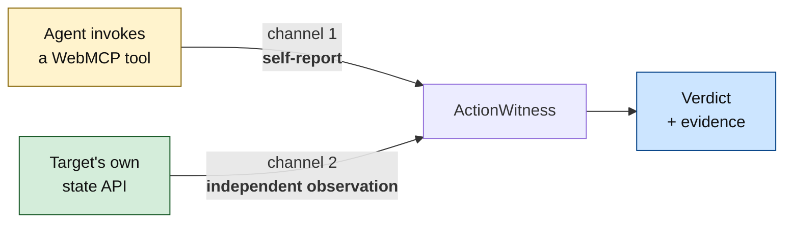

The two channels are kept apart by *type*, not by convention.
`ToolExecutionResult` and `Observation` are distinct models in
`packages/actionwitness_core/src/actionwitness_core/ports/models.py`, and the
`ObservationProvider` protocol is deliberately unrelated to the execution
protocols so no adapter can satisfy an observation by returning what a tool said.
Constitution §4 states the rule the types enforce: *a successful tool response
must never be persisted as manufactured observed state.*

Everything else in this document is scaffolding around that comparison: how the
two channels stay independent, how the comparison is recorded so somebody else
can check it, and how a human stays in charge of anything consequential.

---

## 2. Design outcomes and honest scope

```mermaid
flowchart TB
    THESIS["The tool's claim is<br/>the channel under test"]

    THESIS --> WEB["Thoughtful WebMCP use"]
    THESIS --> UX["Human–agent experience"]
    THESIS --> VALUE["Usefulness and impact"]
    THESIS --> ORIGINAL["Originality"]
    THESIS --> EXEC["Execution"]

    WEB --> W1["All modelContext access<br/>isolated in one adapter"]
    WEB --> W2["Harness tools dogfood<br/>the same surface"]
    WEB --> W3["getTools identity becomes evidence"]
    WEB --> W4["Human workflow survives<br/>without WebMCP"]

    UX --> U1["One shared workspace"]
    UX --> U2["Actor-labelled timeline"]
    UX --> U3["Server-issued consent"]
    UX --> U4["Guidance names who acts next"]

    VALUE --> V1["Regression harness<br/>for tool builders"]
    VALUE --> V2["Storefront Witness<br/>for surface operators"]

    ORIGINAL --> O1["Checks whether the world changed,<br/>not merely whether the call looked right"]

    EXEC --> E1["Architecture gates"]
    EXEC --> E2["Independent-install proofs"]
    EXEC --> E3["Public-entry-point tests"]

    classDef thesis fill:#ede9fe,stroke:#6d28d9,color:#2e1065,stroke-width:2px;
    classDef outcome fill:#dbeafe,stroke:#1d4ed8,color:#172554;
    classDef proof fill:#f8fafc,stroke:#64748b,color:#0f172a;
    class THESIS thesis;
    class WEB,UX,VALUE,ORIGINAL,EXEC outcome;
    class W1,W2,W3,W4,U1,U2,U3,U4,V1,V2,O1,E1,E2,E3 proof;
```

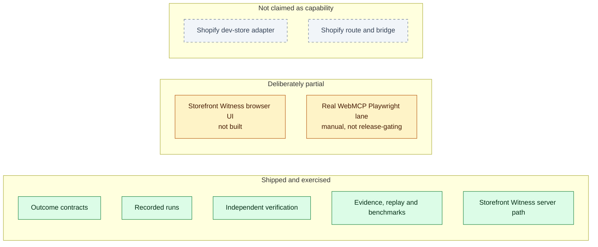

The browser API is used deliberately, not pervasively. The product complements
call-selection evaluators: they assess whether an invocation looked right;
ActionWitness assesses whether independently observed state proves the outcome.
Configuration is never treated as capability: Shopify remains disabled until a
real adapter is registered and its route is mounted.

---

## 3. Topology

Two processes behind one origin. The separation is load-bearing.

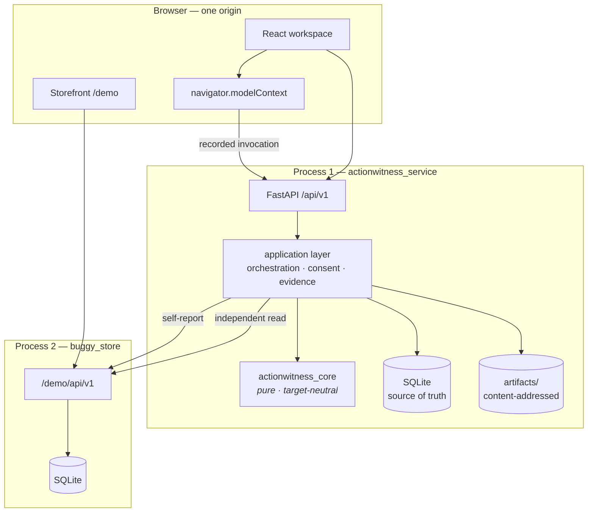

**Why two processes.** The harness must not import the demo target. Co-location
in one container "shall not bypass the versioned target API or adapter boundary"
(§25.11), so the store runs as its own process on loopback and the only route
between them is an HTTP call to `/demo/api/v1` — the same route the adapter uses
in development and the same one the tests exercise. Importing `buggy_store` into
the service would have been fewer moving parts and a different product: the
observation would no longer be independent of the thing it observes.

`scripts/docker-entrypoint.sh` keeps the shell as PID 1 and forwards `SIGTERM` to
both children, so each gets to run its own shutdown.

---

## 4. Layers and dependency direction

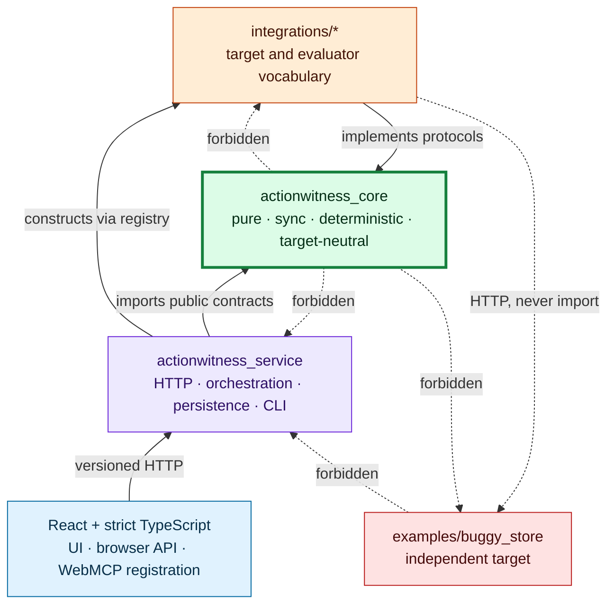

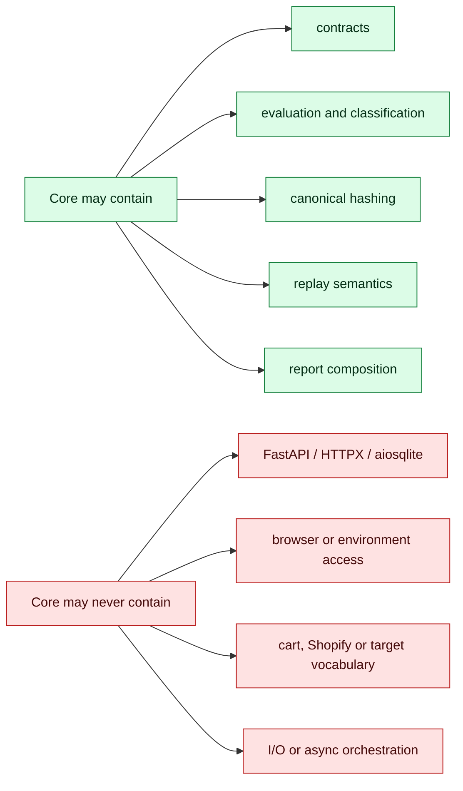

The dependency direction is executable architecture:
`tests/architecture/test_import_boundaries.py` walks the AST and refuses
forbidden edges. Two scripts install one distribution into a fresh environment:

```bash
uv run python scripts/core_only_isolation.py    # core installs and tests ALONE
uv run python scripts/store_only_isolation.py   # store installs and runs ALONE
```

Together the AST gate and isolation scripts prove the arrows rather than merely
describing them. Target-specific vocabulary stays behind the public protocols in
`ports/__init__.py`.

---

## 5. The evidence model

### Evidence graph

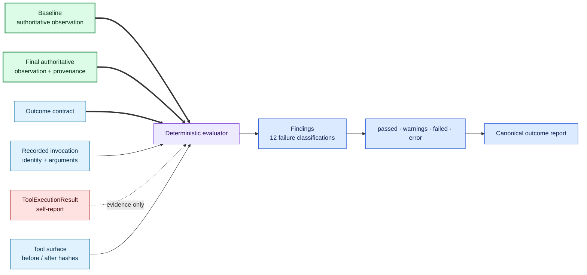

The adapter checks `Observation.provenance`; it does not accept caller-authored
source labels. `observation_unavailable` is intentionally a non-pass rather than
a softer success classification.

### Artifact commit protocol

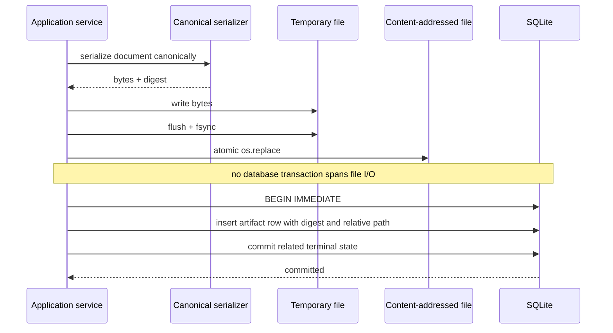

### Every artifact read crosses one integrity gate

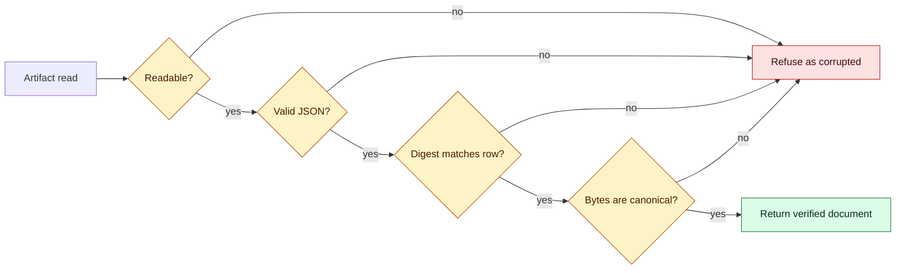

Artifact paths are `<workspace>/<run>/<type>-<digest>.json` (ADR-0007). A
corruption refusal exposes neither the path nor the digest. No database
transaction spans file I/O because `BEGIN IMMEDIATE` is SQLite's single writer
for every workspace (ADR-0003).

---

## 6. WebMCP integration

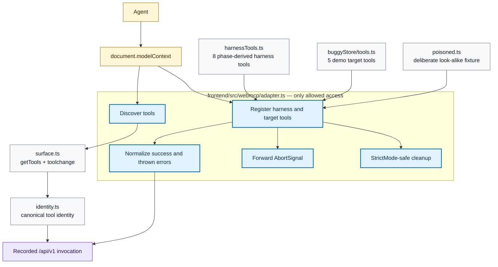

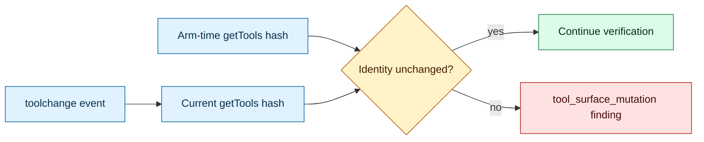

No Python-side WebMCP registration exists. TypeScript owns browser registration;
Python owns recorded invocation identity. Without `modelContext`, the complete
human workflow remains available.

---

## 7. Human–agent experience

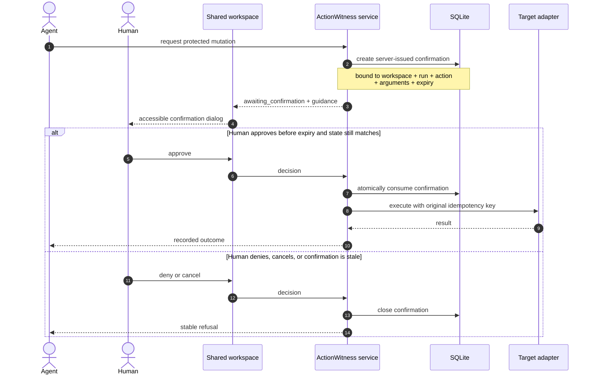

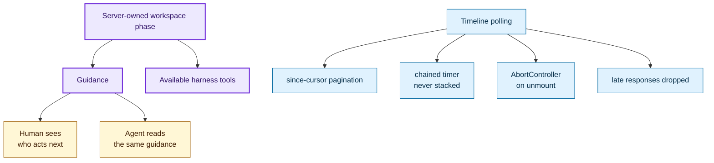

The dialog owns focus placement, keyboard trapping, single-settle cancellation
and focus restoration; it does not own authorization. An agent cannot create,
broaden or approve its own consent. Nothing in this workflow requires WebMCP.

---

## 8. Storefront Witness — auditing a surface you did not build

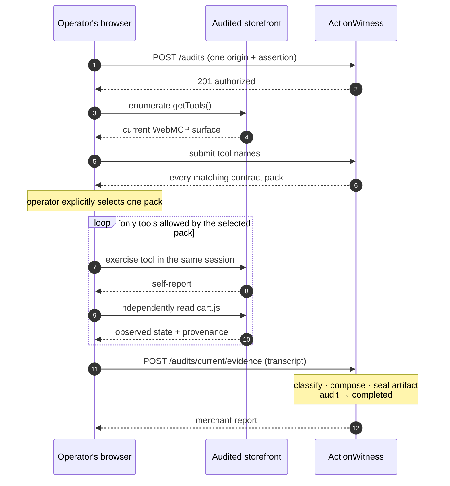

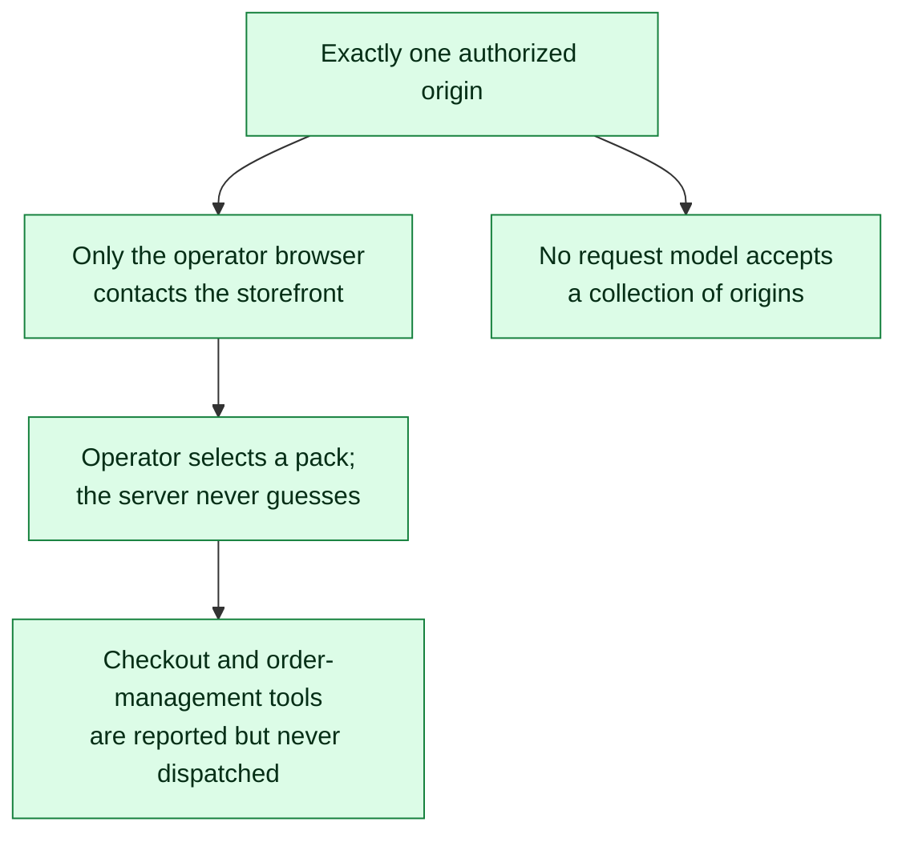

The server never touches the audited site; architecture tests forbid audit
modules from acquiring a network client. The server path is complete and tested,
while the operator-facing browser client is not yet built.

---

## 9. Lifecycles

### Outcome run

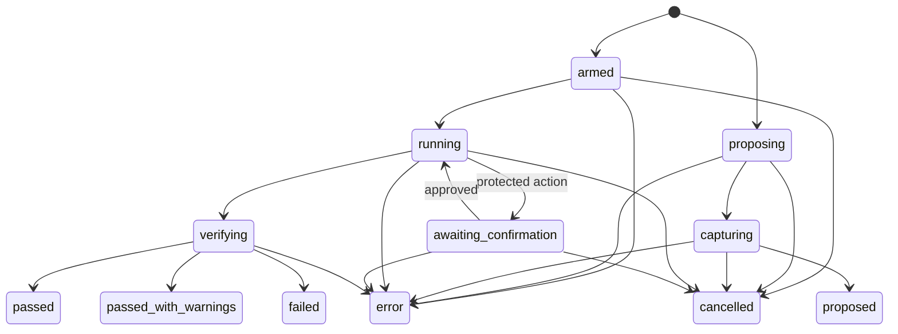

`proposed`, the three verdict states, `cancelled` and `error` are terminal.
`reset` is a workspace action valid from every run state; it does not reopen a
terminal run.

### External audit

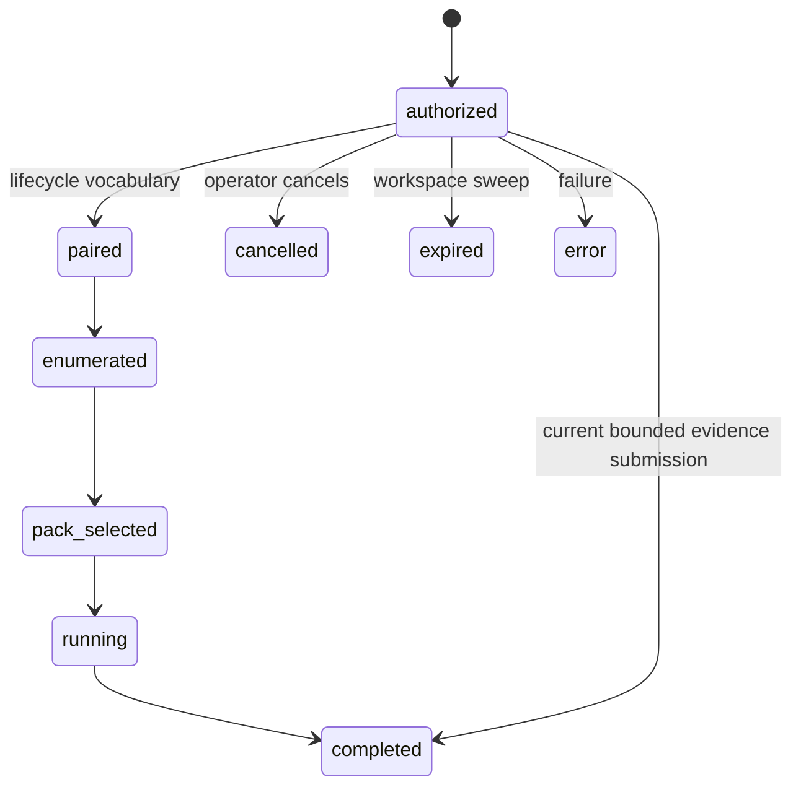

The nine statuses are the specification's closed vocabulary. The current server
persists the bounded API path directly from `authorized` to `completed` or
`cancelled`; the browser client that would surface every intermediate phase is
not built. A partial unique index permits one nonterminal audit per workspace.

### Regression eval and benchmark suite

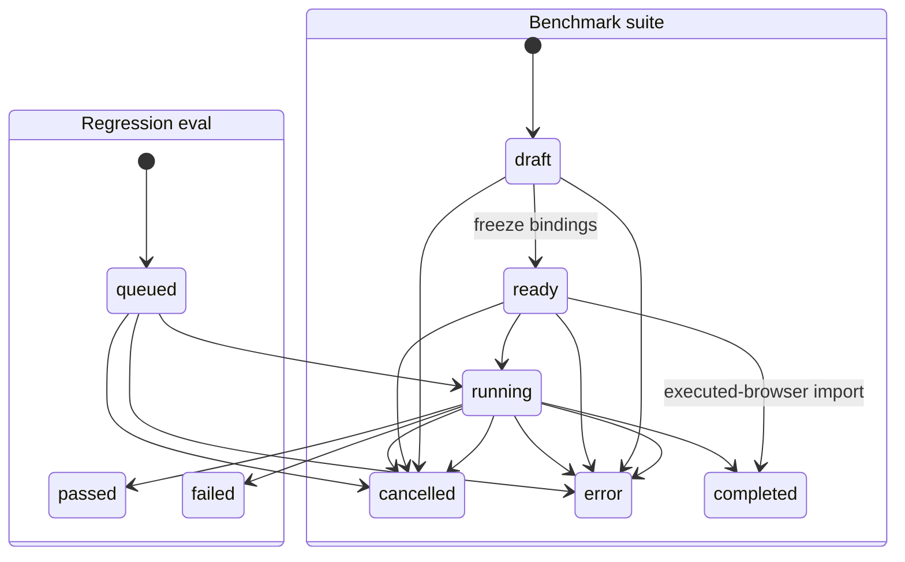

Core transition tables validate all run, eval and benchmark state changes.
Invalid movement is a stable refusal, not a persisted row. A benchmark becomes
immutable at `ready`; changed bindings require a new suite.

---

## 10. Persistence, isolation and determinism

### Workspace is the isolation boundary

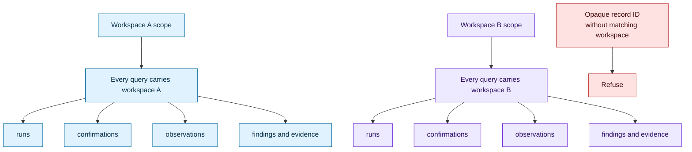

### Transaction and I/O choreography

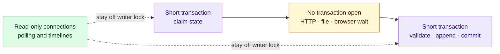

### Replay is deterministic by construction

```mermaid
flowchart LR
    INPUT["Same versioned input"]
    CLOCK["Injected UTC clock"]
    IDS["Injected identifiers"]
    RNG["Injected randomness"]
    CORE["Pure synchronous core"]
    OUTPUT["Same findings and verdict"]

    INPUT --> CORE
    CLOCK --> CORE
    IDS --> CORE
    RNG --> CORE
    CORE --> OUTPUT

    classDef input fill:#e0f2fe,stroke:#0369a1,color:#082f49;
    classDef core fill:#dcfce7,stroke:#15803d,color:#052e16,stroke-width:2px;
    classDef output fill:#dbeafe,stroke:#1d4ed8,color:#172554;
    class INPUT,CLOCK,IDS,RNG input;
    class CORE core;
    class OUTPUT output;
```

SQLite is canonical and uses WAL, foreign keys, a busy timeout and
`synchronous = FULL`; ordered migrations run during application lifespan. Locks
are per-workspace and reference-counted. Money is exact `Decimal`, time is UTC,
and a changed intent may never reuse an idempotency key.

---

## 11. Boundaries and safety rails

```mermaid
flowchart TB
    HTTP["HTTP bodies, headers,<br/>cookies and paths"]
    MCP["WebMCP arguments<br/>and results"]
    IMPORTS["Imported reports"]
    TARGET["Target and adapter responses"]
    STORAGE["Persisted JSON<br/>and browser storage"]
    URLS["Origins, redirects<br/>and final URLs"]

    VALIDATE["Boundary validation"]
    AUTHZ["Workspace scope + authorization"]
    REDACT["Redaction before persistence/logging"]
    LIMITS["Size, depth, rate and count limits"]
    CORE["Trusted domain input"]

    HTTP --> VALIDATE
    MCP --> VALIDATE
    IMPORTS --> VALIDATE
    TARGET --> VALIDATE
    STORAGE --> VALIDATE
    URLS --> VALIDATE
    VALIDATE --> AUTHZ --> REDACT --> LIMITS --> CORE

    classDef untrusted fill:#fee2e2,stroke:#b91c1c,color:#450a0a;
    classDef guard fill:#fef3c7,stroke:#b45309,color:#451a03;
    classDef trusted fill:#dcfce7,stroke:#15803d,color:#052e16;
    class HTTP,MCP,IMPORTS,TARGET,STORAGE,URLS untrusted;
    class VALIDATE,AUTHZ,REDACT,LIMITS guard;
    class CORE trusted;
```

```mermaid
flowchart LR
    FAILURE["Boundary, domain or<br/>unexpected failure"]
    MAP["Closed ApiErrorCode registry"]
    RESPONSE["Client envelope<br/>code · message · retryable"]
    REQUEST_LOG["Structured request line<br/>route template · status · duration · IDs"]
    TRACEBACK["Internal diagnostic logger<br/>traceback for operators"]
    FORBIDDEN["Never exposed<br/>secrets · paths · hashes · traceback"]

    FAILURE --> MAP --> RESPONSE
    FAILURE --> REQUEST_LOG
    FAILURE --> TRACEBACK
    FORBIDDEN -. "excluded by model shape" .-> RESPONSE
    FORBIDDEN -. "excluded by model shape" .-> REQUEST_LOG

    classDef fail fill:#fee2e2,stroke:#b91c1c,color:#450a0a;
    classDef guard fill:#fef3c7,stroke:#b45309,color:#451a03;
    classDef output fill:#e0f2fe,stroke:#0369a1,color:#082f49;
    class FAILURE fail;
    class MAP,FORBIDDEN guard;
    class RESPONSE,REQUEST_LOG,TRACEBACK output;
```

Python uses closed Pydantic boundary models. TypeScript narrows `unknown` under
`strict`, `exactOptionalPropertyTypes` and `noUncheckedIndexedAccess`. Origins
are normalized and compared by equality; malformed authorities refuse rather
than raise. Error retryability comes from the registry, not individual call
sites.

---

## 12. Deployment

```mermaid
flowchart TB
    IMAGE["One non-root Docker image"]
    SHELL["Entrypoint shell<br/>PID 1 · signal forwarding · child reaping"]
    HARNESS_ENV["Isolated harness virtualenv"]
    STORE_ENV["Isolated store virtualenv"]
    UVICORN["One Uvicorn worker<br/>load-bearing SQLite decision"]
    STORE["Buggy Store process"]
    ORIGIN["One public origin"]

    IMAGE --> SHELL
    SHELL --> HARNESS_ENV --> UVICORN --> ORIGIN
    SHELL --> STORE_ENV --> STORE --> ORIGIN

    classDef image fill:#ede9fe,stroke:#6d28d9,color:#2e1065,stroke-width:2px;
    classDef process fill:#e0f2fe,stroke:#0369a1,color:#082f49;
    classDef origin fill:#dcfce7,stroke:#15803d,color:#052e16;
    class IMAGE,SHELL image;
    class HARNESS_ENV,STORE_ENV,UVICORN,STORE process;
    class ORIGIN origin;
```

```mermaid
flowchart TB
    START["Container starts"]
    CONFIG{"Production public origin<br/>present, valid and HTTPS?"}
    DB{"Database readable<br/>right now?"}
    ASSETS{"Frontend assets mounted?"}
    READY["/healthz 200<br/>ready to serve"]
    HOLD["/healthz 503<br/>hold deployment"]

    START --> CONFIG
    CONFIG -->|no| HOLD
    CONFIG -->|yes| DB
    DB -->|no| HOLD
    DB -->|yes| ASSETS
    ASSETS -->|no| HOLD
    ASSETS -->|yes| READY

    classDef gate fill:#fef3c7,stroke:#b45309,color:#451a03;
    classDef good fill:#dcfce7,stroke:#15803d,color:#052e16;
    classDef bad fill:#fee2e2,stroke:#b91c1c,color:#450a0a;
    class CONFIG,DB,ASSETS gate;
    class READY good;
    class HOLD bad;
```

Health probes the database live rather than trusting startup state. The current
free-tier deployment has no attached disk, so SQLite and evidence artifacts are
intentionally ephemeral across redeploys; `docs/release-checklist.md` records
that operator-approved trade-off.

---

## 13. Verifying these claims yourself

```mermaid
flowchart TB
    CLAIMS["Architecture claims"]

    CLAIMS --> IMPORTS["Dependency direction"]
    IMPORTS --> I1["test_import_boundaries.py"]
    IMPORTS --> I2["core_only_isolation.py"]
    IMPORTS --> I3["store_only_isolation.py"]

    CLAIMS --> WEBMCP["Browser seam"]
    WEBMCP --> W1["test_webmcp_adapter_isolation.py"]
    WEBMCP --> W2["test_harness_tool_surface.py"]
    WEBMCP --> W3["manual Playwright lane"]

    CLAIMS --> SAFETY["Safety and scope"]
    SAFETY --> S1["test_audit_guardrails.py"]
    SAFETY --> S2["test_product_copy_claims.py"]
    SAFETY --> S3["test_release_artifact_hygiene.py"]

    CLAIMS --> DELIVERY["Build and documentation"]
    DELIVERY --> D1["test_bundle_shape.py"]
    DELIVERY --> D2["test_readme_commands.py"]
    DELIVERY --> D3["test_codemaps.py"]
    DELIVERY --> D4["test_adr_records.py"]

    classDef claim fill:#ede9fe,stroke:#6d28d9,color:#2e1065,stroke-width:2px;
    classDef area fill:#dbeafe,stroke:#1d4ed8,color:#172554;
    classDef gate fill:#dcfce7,stroke:#15803d,color:#052e16;
    class CLAIMS claim;
    class IMPORTS,WEBMCP,SAFETY,DELIVERY area;
    class I1,I2,I3,W1,W2,W3,S1,S2,S3,D1,D2,D3,D4 gate;
```

Run the executable checks behind the map:

```bash
uv run pytest tests/architecture -q            # every gate in this document
uv run pytest -q                               # full suite
uv run python scripts/core_only_isolation.py   # core really does install alone
cd apps/actionwitness_service/frontend && npm run typecheck && npm test
```

The architecture suite checks boundaries; the full suite checks behavior through
public entry points. The manual browser lane is the only layer that exercises
real WebMCP and should be run before release even though it is not a formal gate.

---

## 14. Known limits

```mermaid
flowchart TB
    ROOT["Known architectural pressure"]

    ROOT --> DB["Database"]
    DB --> DB1["No connection pool"]
    DB --> DB2["A connection and worker thread<br/>per operation"]
    DB --> DB3["1 Hz polling makes overhead visible"]

    ROOT --> ART["Artifacts"]
    ART --> ART1["An orphan whose row never committed<br/>is invisible to row-driven cleanup"]

    ROOT --> QUALITY["Quality signals"]
    QUALITY --> Q1["No coverage regression measurement"]
    QUALITY --> Q2["Real WebMCP Playwright lane<br/>does not run in CI"]

    ROOT --> SIZE["Module size"]
    SIZE --> S1["invocation_service.py"]
    SIZE --> S2["verification_service.py"]
    SIZE --> S3["panels.tsx"]
    SIZE --> S4["webmcp/adapter.ts"]

    ROOT --> PRODUCT["Product surface"]
    PRODUCT --> P1["Storefront Witness UI not built"]
    PRODUCT --> P2["Shopify dev-store target not built"]

    ROOT --> JUDGE["Authority"]
    JUDGE --> J1["An LLM is never the business-state judge"]
    JUDGE --> J2["Ambiguous correctness<br/>returns to a human"]

    classDef root fill:#ede9fe,stroke:#6d28d9,color:#2e1065,stroke-width:2px;
    classDef area fill:#fef3c7,stroke:#b45309,color:#451a03;
    classDef limit fill:#f8fafc,stroke:#64748b,color:#0f172a;
    class ROOT root;
    class DB,ART,QUALITY,SIZE,PRODUCT,JUDGE area;
    class DB1,DB2,DB3,ART1,Q1,Q2,S1,S2,S3,S4,P1,P2,J1,J2 limit;
```

These are explicit trade-offs or unfinished surfaces, not hidden capabilities.
Measure the database path before introducing pooling; split the named modules
before adding another responsibility; never weaken observation independence to
make a demo or benchmark pass.
