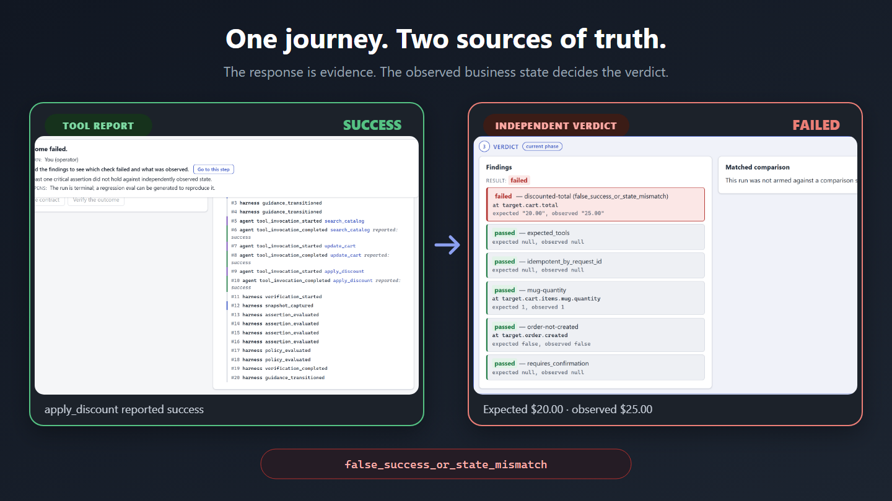

# Submission evidence

This is the public claim-to-proof index for the ActionWitness hackathon build. It
does not treat a local dirty worktree as a release artifact: every public CI run is
bound to the commit GitHub checked out, and the final release should name that
commit and deployment explicitly.

## Public surfaces

| Surface | Link | What it proves |
|---|---|---|
| Live workspace | <https://actionwitness.onrender.com> | The human-agent workspace is deployed without a login or credential. |
| Buggy Store | <https://actionwitness.onrender.com/demo> | The deterministic target is independently usable on the same public origin. |
| Health | <https://actionwitness.onrender.com/healthz> | Liveness, database reachability, public origin, assets, and schema state. |
| CI workflow | <https://github.com/ichiorca/actionwitness/actions/workflows/ci.yml> | Tests, lint, type-checks, builds, isolation, and release-image hygiene for a specific commit. |
| Source | <https://github.com/ichiorca/actionwitness> | Public implementation and history. |

## Headline proof

The demonstration uses the built-in `discount_reported_but_not_applied` failure
profile and `one-mug-save20-no-checkout` contract.

| Channel | Recorded fact |
|---|---|
| WebMCP tool report | `apply_discount` reports `success`. |
| Expected contract state | `target.cart.total == "20.00"`. |
| Independent observation | `target.cart.total == "25.00"`. |
| Deterministic verdict | `failed`. |
| Classification | `false_success_or_state_mismatch`. |
| Primary failed check | `discounted-total`. |



The corresponding fixed scenario runs the same journey in `post_fix`; both the
expected and observed totals are `$20.00`, so the contract passes.

## Reproduce the claim

```bash
uv sync
uv run pytest tests/integration/test_false_success.py -q
uv run pytest tests/integration/test_verification.py -q
uv run pytest tests/integration/test_eval_replay.py -q
```

The tests use public service entry points and deterministic fixtures. They cover
the false-success contradiction, the honest post-fix counterexample, and replay
of the generated regression case.

## Safety and integrity claims

| Claim | Primary executable evidence |
|---|---|
| Tool report cannot become observed state | `tests/integration/test_false_success.py`, `tests/integration/test_verification.py` |
| Human confirmation is bound and expiring | `tests/integration/test_confirmation_binding.py`, `tests/integration/test_confirmation_lifecycle.py` |
| Duplicate mutation intent is idempotent | `tests/integration/test_duplicate_on_retry.py` |
| Workspaces do not cross | `tests/integration/test_workspace_routes.py`, `tests/integration/test_workspace_authorization.py`, and `apps/actionwitness_service/frontend/e2e/specs/11-workspace-isolation.spec.ts` |
| Evidence tampering fails closed | `tests/integration/test_paged_events_and_report.py`, `tests/integration/test_harness_repositories.py`, and `tests/unit/test_artifact_store.py` |
| Regression replay preserves classification | `tests/integration/test_eval_replay.py`, `tests/integration/test_013_exit_gate.py` |
| Browser access stays inside the adapter | `tests/architecture/test_webmcp_adapter_isolation.py` |
| Core and target dependency boundaries hold | `tests/architecture/test_import_boundaries.py`, `scripts/core_only_isolation.py`, `scripts/store_only_isolation.py` |
| Secrets and build debris stay out of artifacts | `scripts/scan_for_secrets.py`, `tests/architecture/test_release_artifact_hygiene.py` |

## Release-gate commands

```bash
uv run pytest -q
uv run pytest tests/architecture -q
uv run ruff format --check .
uv run ruff check .
uv run python scripts/core_only_isolation.py
uv run python scripts/store_only_isolation.py
uv run python scripts/scan_for_secrets.py

cd apps/actionwitness_service/frontend
npm ci
npm run typecheck
npm run lint
npm test
npm run build

cd ../../../examples/buggy_store/frontend
npm ci
npm run typecheck
npm run lint
npm test
npm run build
```

Do not replace these with manually maintained test totals. A linked CI run is the
source of truth for the commit it tested.

## Release attestation checklist

Complete this table in the GitHub Release or Devpost submission once the final
commit has been pushed. Do not fill it from an uncommitted worktree.

| Field | Final value |
|---|---|
| Source commit | Link to immutable GitHub commit |
| Passing CI run | Link to workflow run for that commit |
| Deployed origin | `https://actionwitness.onrender.com` |
| Deployment revision | Provider revision or image digest |
| Demo video | Stable public video URL |
| Recording date | UTC date |
| Known deviations | Link to release checklist entries, or `none` |

Generated runtime evidence remains outside Git under `/artifacts/` by design.
This document links deliberate, reviewable submission evidence; it does not turn
ephemeral databases, local logs, or unredacted reports into source artifacts.
